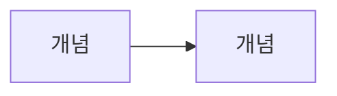

# (title과 동일한 제목)

<!-- 도입: 독자가 검색해서 들어온 질문을 첫 문단에서 바로 받아준다. 2~4문장 -->

## 핵심 답변

<!-- 질문에 대한 답을 먼저 요약. 그 뒤 섹션에서 풀어 설명 -->

## (개념 설명 섹션 1~3개, 제목은 내용에 맞게)

<!-- 필요 시 mermaid 다이어그램 또는 표 사용:

-->

## 예시로 이해하기

<!-- 실제 숫자를 넣은 구체적 예시 최소 1개. 필수 -->

## 한 줄 정리

<!-- 챕터 전체를 1~3문장으로 요약 -->

---

> 이 글은 투자 판단에 도움이 되는 일반적인 정보를 제공할 뿐, 특정 종목이나 상품의 매매를 권유하지 않아요. 제도와 세금은 바뀔 수 있으니 실제 투자 전에는 최신 내용을 다시 확인하세요.

<!-- 관련 챕터 내부 링크:
> 함께 보면 좋은 글: [1-6. 시가총액·주가·거래량, 숫자 읽는 법](1-6-market-cap-price-volume.md)
-->
