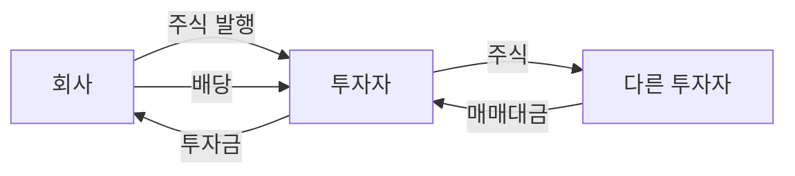

# 주식이란 무엇인가 — 회사 지분을 산다는 것의 의미

주식 투자를 시작해 보려는데, 막상 "주식이 뭔데?"라는 질문에는 선뜻 답이 안 나오죠. 뉴스에는 주가가 올랐다 내렸다 하는 이야기만 나오고, 정작 내가 사는 게 무엇인지는 아무도 설명해 주지 않아요. 이 글에서 그 첫 질문 하나만 확실히 짚고 갈게요. 다른 글을 먼저 읽지 않아도 괜찮아요.

## 핵심 답변

**주식은 회사의 소유권을 잘게 쪼갠 조각이에요.** 그래서 주식을 산다는 건 그 회사의 주인 중 한 명이 된다는 뜻이고, 이렇게 주식을 가진 사람을 **주주**라고 불러요. 그리고 회사에서 내 것인 몫의 비율을 **지분**이라고 해요.

케이크를 열 조각으로 나눠 한 조각을 가지면 10분의 1이 내 것이 되죠. 회사도 똑같아요. 삼성전자 주식 1주를 사면 그 순간부터 삼성전자라는 회사의 아주 작은 지분이 내 소유가 돼요. 회사가 잘되면 내 몫도 커지고, 어려워지면 내 몫도 줄어들어요.

## 회사는 왜 주식을 발행할까요

회사가 공장을 짓거나 사람을 더 뽑으려면 돈이 필요해요. 방법은 크게 두 가지예요.

하나는 **빌리는 것**이에요. 은행 대출은 정해진 날짜에 이자까지 붙여 반드시 갚아야 하고, 적자가 나도 이자는 나가요.

다른 하나가 **주식을 발행하는 것**이에요. 발행이란 회사가 새 주식을 만들어 파는 걸 말해요. 회사는 소유권의 일부를 내주는 대신 투자금을 받고, 이 돈은 갚을 의무가 없어요. 이렇게 만든 주식을 누구나 사고팔 수 있도록 **거래소**, 즉 주식 매매를 중개하는 공식 시장에 등록하는 것이 **상장**이에요. 증권 앱에 뜨는 **종목**은 이렇게 상장되어 사고팔 수 있게 된 개별 회사의 주식이에요.

### 내가 낸 돈은 회사로 갈까요

여기서 가장 많이 오해하는 지점이 있어요. **회사 통장에 돈이 들어가는 건 회사가 주식을 새로 발행해서 팔 때뿐이에요.** 우리가 증권 앱에서 삼성전자를 살 때는 이미 세상에 나와 있는 주식을 지금 팔겠다는 다른 투자자에게서 넘겨받는 거라, 그 돈은 삼성전자가 아니라 그 투자자에게 가요. 조각의 주인만 바뀌는 거죠. 위 그림에서 회사와 주고받는 화살표는 처음 발행할 때의 이야기이고, 투자자끼리 오가는 화살표가 지금 우리가 하는 매매라고 보면 돼요.

## 주주가 되면 무엇을 갖게 되나요

주식을 사서 주주가 되면 크게 세 가지를 얻어요.

**첫째, 의결권이에요.** 회사의 중요한 일을 결정하는 회의를 주주총회라고 하는데, 주주는 여기서 찬성이나 반대 의사를 밝힐 수 있어요. 원칙적으로 1주에 1표라서 많이 가진 사람일수록 목소리가 커요.

**둘째, 배당을 받을 권리예요.** 배당은 회사가 그동안 쌓아온 이익 가운데 일부를 주주에게 나눠주는 현금이에요. 그해 벌어들인 돈만으로 정해지는 게 아니라서, 이익이 많이 난 해에도 배당을 안 줄 수 있고 반대로 실적이 나빴던 해에도 쌓아둔 이익으로 배당을 주기도 해요. 번 돈을 사업에 다시 투자하려고 아예 배당을 하지 않는 회사도 많고요. 배당을 언제 얼마나 받는지, 배당락 같은 말은 무슨 뜻인지는 [2-3. 배당이란 — 배당락, 배당 기준일, 배당수익률](../part2-korea-market/2-3-dividend-basics.md)에서 따로 다뤄요.

**셋째, 시세차익에 대한 기대예요.** 시세차익은 산 가격보다 비싼 가격에 팔아 남기는 차액이에요. 1만 원에 산 주식을 1만 5천 원에 팔면 5천 원이 시세차익인데, 이 돈은 회사가 아니라 그 주식을 사간 다른 투자자에게서 와요. 다만 이건 권리가 아니라 기대예요. 반대로 8천 원에 팔면 2천 원을 잃어요.

**대신 손실은 내가 넣은 돈까지만이에요.** "회사의 주인"이라고 하면 회사가 망했을 때 빚까지 떠안는 건 아닌지 걱정될 수 있는데, 그렇지 않아요. 주주가 지는 책임은 투자한 금액이 전부라서 최악의 경우에도 산 주식 값을 잃는 데서 끝나요. 이걸 유한책임이라고 해요.

## 주가는 왜 오르내리나요

주식에는 정찰제 가격표가 없어요. 주가는 그 순간 사겠다는 사람과 팔겠다는 사람이 합의한 가격일 뿐이라서, 사려는 사람이 더 많으면 올라가고 반대면 내려가요. 그럼 왜 사고 싶어질까요? 그 회사가 앞으로 돈을 더 잘 벌 것 같다고 믿기 때문이에요. 실적 발표, 신제품, 업황(그 업종 전체의 경기) 전망 같은 소식이 이 믿음을 흔들 때마다 주가가 움직여요.

## 예시로 이해하기

친구와 치킨집을 차린다고 해볼게요. 창업 비용은 1억 원이에요.

이 가게를 **1만 조각으로 나누면 한 조각의 값은 1만 원**이에요(1억 원 ÷ 1만 주). 이 한 조각이 바로 1주예요. 내가 100만 원을 내고 100주를 샀다면, 이 치킨집의 1%를 가진 주주가 된 거예요(100주 ÷ 1만 주).

1년 뒤 장사가 잘돼 가게 가치가 **2억 원**이 되었다고 해볼게요. 조각 수는 그대로 1만 주니까 한 조각의 값은 2만 원이 돼요(2억 원 ÷ 1만 주). 내 100주는 200만 원이 되었고, 이때 사겠다는 사람에게 팔면 100만 원이 남아요. 이게 **시세차익**이에요.

여기에 더해 순이익, 즉 매출에서 재료비와 인건비, 세금을 다 빼고 남은 돈이 1,000만 원인데 그중 500만 원을 주주에게 나눠주기로 했다면, 1주당 500원씩 돌아가요(500만 원 ÷ 1만 주). 100주를 가진 나는 5만 원을 받아요. 이게 **배당**이에요.

반대 경우도 봐야 해요. 근처에 더 맛있는 가게가 생겨서 가게 가치가 5,000만 원으로 떨어지면 한 조각은 5,000원이 되고, 내 100주는 50만 원이 돼요. 100만 원을 넣었으니 50만 원을 잃은 거예요.

다만 상장회사의 주가는 이렇게 나눗셈으로 딱 떨어지지 않아요. 회사 가치를 주식 수로 나눈 값은 기준점일 뿐이고, 실제 주가는 여기에 "앞으로 더 잘될까"라는 사람들의 기대가 얹혀서 사겠다는 사람과 팔겠다는 사람 사이에서 정해져요.

## 한 줄 정리

주식은 회사의 소유권을 잘게 쪼갠 조각이고, 주식을 산다는 건 그 회사의 작은 주인이 된다는 뜻이에요. 주주는 의결권과 배당받을 권리를 갖고 회사가 성장하면 시세차익도 기대할 수 있어요. 손실은 투자한 금액까지로 제한되지만 그 돈을 전부 잃을 수도 있다는 점은 꼭 기억해 주세요.

> 함께 보면 좋은 글
> - [1-2. 증권계좌 개설, 어디서 어떻게 하나](1-2-open-brokerage-account.md)
> - [1-6. 시가총액·주가·거래량, 숫자 읽는 법](1-6-market-cap-price-volume.md)
> - [2-3. 배당이란 — 배당락, 배당 기준일, 배당수익률](../part2-korea-market/2-3-dividend-basics.md)
