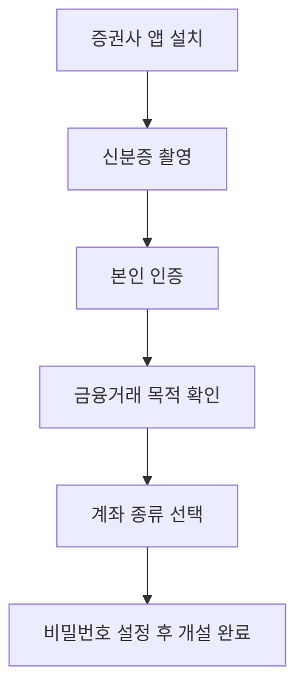

# 증권계좌 개설, 어디서 어떻게 하나

주식을 사기로 마음먹었는데 어디로 가서 뭘 해야 할지 막막하죠. 은행처럼 창구에 가야 하나 싶기도 하고요. 결론부터 말하면 스마트폰만 있으면 집에서 끝나요. 제도와 관련된 내용은 **2026년 7월 기준**이라 나중에 바뀔 수 있다는 점만 참고해 주세요.

## 핵심 답변

**증권사 앱에서 비대면으로, 10분이면 만들 수 있어요.** 비대면이란 지점 창구에 가지 않고 앱 안에서 신분 확인까지 모두 마치는 방식이에요.

준비물은 세 가지뿐이에요.

- **본인 명의 스마트폰** — 문자로 오는 인증번호를 받아야 해요
- **신분증** — 훼손되지 않은 주민등록증이나 운전면허증 실물, 모바일 신분증 앱을 받는 곳도 있어요
- **본인 명의의 다른 금융기관 계좌** — 은행 통장 하나면 충분해요

여기서 **증권계좌**란 주식을 사고파는 데 쓰는 전용 계좌예요. 은행 통장에 든 돈으로는 주식을 바로 살 수 없고, 그 돈을 증권계좌로 옮겨야 주문을 넣을 수 있어요. 주식은 **거래소**라는 공식 시장에서 거래되는데([1-1. 주식이란 무엇인가](1-1-what-is-stock.md)), 개인이 직접 갈 수는 없고 대신 주문을 넣어주는 회사가 **증권사**거든요.

## 증권사 고르는 기준

증권사는 수십 곳이 있지만 어디서 만들든 살 수 있는 주식은 똑같아요. 그래서 "어디가 제일 좋냐"보다 **내 조건에 맞는 기준으로 고르는 것**이 맞아요. 네 가지만 보면 충분해요.

**첫째, 수수료예요.** 수수료는 주식을 사고팔 때마다 증권사가 떼어가는 중개료로, 매매를 자주 할수록 쌓여요. "평생 무료" 광고도 대개 국내주식 온라인 주문에만 해당하니 조건을 눌러 확인해 보세요. 어떤 비용이 붙는지는 [1-5. 수수료와 세금](1-5-fees-and-taxes.md)에서 다뤄요.

**둘째, 앱 편의성이에요.** 주식 앱을 **MTS**(모바일 트레이딩 시스템)라고 불러요. 초보일수록 화면이 단순한 쪽이 유리한데, 대부분 계좌 없이도 설치해 둘러볼 수 있어요.

**셋째, 내가 사려는 것을 취급하는지예요.** 미국주식을 살 생각이라면 해외주식을 지원하는지, 환전 우대가 있는지 봐요. 환전 우대란 원화를 달러로 바꿀 때 붙는 수수료를 깎아주는 걸 말해요.

**넷째, 개설 이벤트예요.** 신규 개설자에게 현금이나 수수료 할인을 주는 이벤트가 상시로 열리는데, 혜택 기간이 끝난 뒤의 기본 수수료가 진짜 조건이에요.

증권계좌는 여러 곳에 만들어도 되고 유지비도 없으니, 처음부터 완벽하게 고르려 애쓸 필요는 없어요.

## 비대면 개설 절차

순서는 어느 증권사나 비슷해요.

**신분증 촬영**은 앱 카메라로 찍기만 하면 진위를 자동으로 대조해 줘요.

**본인 인증**은 금융위원회의 비대면 실명확인 가이드라인에 따라 두 가지 이상 방법을 겹쳐서 해요. 가장 흔한 조합이 휴대폰 문자 인증과 **타행 계좌 인증**이에요. 타행 계좌 인증은 증권사가 내 은행 계좌로 1원을 보내고, 입금자명에 찍힌 몇 글자를 앱에 입력하는 거예요. 영상통화도 인정되지만 필수가 아니라 보통 이 조합으로 끝나요.

**금융거래 목적 확인**은 2024년 8월 28일부터 법으로 의무화된 절차예요. 대포통장을 막으려고 계좌를 왜 만드는지 고르게 하는 건데, 주식 투자 목적을 선택하면 돼요. 증빙서류를 내지 않으면 **한도제한계좌**로 열려요. 하루 출금·이체가 창구는 300만 원, ATM과 온라인은 100만 원으로 묶이는 계좌예요. 다만 묶이는 건 돈을 밖으로 빼는 거래라서 **주식을 사고파는 것 자체는 막히지 않아요.** 한도는 나중에 증빙서류를 내면 풀려요.

여기까지 마치고 비밀번호를 정하면 개설이 끝나요. 이제 은행에서 증권계좌로 돈을 옮기고 주문하면 되는데, 주문 방법은 [1-3. 주식 사는 법](1-3-how-to-buy-stocks.md)에서 이어서 볼게요.

## 계좌 종류, 뭘로 만들까

개설 도중 계좌 종류를 고르는 화면이 나와요. 크게 두 갈래예요.

**일반 위탁계좌**는 주식 매매를 위한 가장 기본 계좌예요. 위탁이란 내 주문을 증권사에 맡겨 대신 거래하게 한다는 뜻이에요. 언제든 돈을 넣고 뺄 수 있고 제약도 없어요. **처음이라면 이걸로 시작하면 돼요.**

**절세계좌**는 세금을 깎아주는 대신 조건이 붙는 계좌로, 연금저축펀드·IRP·ISA 세 가지가 있어요. 정해진 나이나 기간 전에 돈을 빼면 혜택을 토해내야 해서, 투자에 익숙해진 뒤 만들어도 늦지 않아요. 자세한 건 [4-4. 연금저축펀드 vs IRP](../part4-etf-pension/4-4-pension-fund-vs-irp.md)와 [4-5. ISA 계좌](../part4-etf-pension/4-5-isa-account.md)에서 다뤄요.

## 예시로 이해하기

민수 씨가 7월 1일에 A증권에서 계좌를 만들었어요. 이벤트가 더 좋아 보이는 B증권에도 만들려고 다음 날 신청했더니 "단기간 다수계좌 개설 제한" 안내가 뜨면서 막혔어요. 흔히 말하는 **20영업일 규칙**이에요.

한 금융기관에서 **입출금이 자유로운 계좌**를 만들면 그 뒤 **20영업일** 동안 다른 곳에서 같은 종류의 계좌를 못 만들게 한 규칙이에요. 대포통장을 막으려고 2010년 금융감독원 행정지도로 도입했다가, 지금은 금융회사들이 자율적으로 운영해요. 은행 입출금통장과 증권사 계좌가 모두 대상이에요.

여기서 **영업일**은 은행이 문을 여는 평일이라 주말과 공휴일은 빠져요. 20영업일이면 달력으로 약 한 달이니, 7월 1일에 만들었다면 7월 말은 되어야 다음 계좌를 열 수 있어요.

막혔을 때 길이 아주 없진 않아요. 자율 운영이라 **회사마다 기준이 다르고**, **영업점 창구에 직접 찾아가면** 열어주는 곳도 있어요. 또 제한 대상이 입출금 계좌라서 **ISA·IRP·연금저축계좌는 빠지는** 경우가 많아요. 2026년 7월 기준으로 이 제한 자체는 여전히 살아 있어요.

계좌가 아예 안 열린다면 볼 게 하나 더 있어요. 2025년 3월부터 시행된 **비대면 계좌개설 안심차단**은 남이 내 명의로 계좌를 못 만들게 막는 장치인데, 걸어뒀다면 본인 개설도 함께 막혀요. 신청은 앱으로도 되지만 **해제는 금융회사 영업점을 방문해야 해요.**

## 한 줄 정리

증권계좌는 증권사 앱에서 비대면으로 10분이면 만들 수 있고, 신분증과 본인 명의 은행 계좌만 있으면 돼요. 증권사는 수수료·앱 편의성·취급 범위·이벤트로 고르고, 계좌 종류는 일반 위탁계좌면 충분해요. 최근 다른 금융기관에서 계좌를 만들었다면 20영업일 규칙에 걸릴 수 있다는 점만 미리 알아두세요.

> 함께 보면 좋은 글
> - [1-1. 주식이란 무엇인가 — 회사 지분을 산다는 것의 의미](1-1-what-is-stock.md)
> - [1-3. 주식 사는 법 — 호가창, 시장가/지정가 주문 이해하기](1-3-how-to-buy-stocks.md)
> - [1-5. 수수료와 세금, 주식 사고팔면 뭘 떼일까](1-5-fees-and-taxes.md)
> - [4-5. ISA 계좌, 왜 만능통장이라 부르나](../part4-etf-pension/4-5-isa-account.md)
