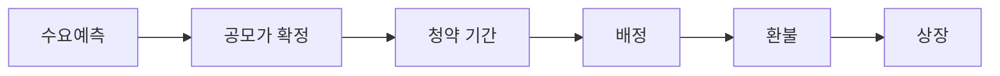

# 공모주 청약, 어떻게 참여하나 — 균등배정과 비례배정, 증거금 계산까지

뉴스에 "이번 공모주 청약 경쟁률 900대 1"같은 기사가 뜨면 다들 관심을 보이는데, 막상 "청약이 뭔지", "돈을 얼마나 넣어야 하는지"는 모르는 채 지나가기 쉬워요. **공모주**는 회사가 상장을 앞두고 처음으로 주식을 새로 발행해 파는 것이라, [1-1](../part1-basics/1-1-what-is-stock.md)에서 말한 **발행시장**(회사가 새로 주식을 만들어 팔아 그 투자금이 회사로 직접 들어가는 시장)에 해당해요. 평소 앱에서 사고파는 건 이미 발행된 주식을 다른 투자자에게서 넘겨받는 유통시장 거래지만, 공모주는 다르게 그 돈이 정말 회사 통장으로 들어가요. 어떻게 참여하는지 순서대로 볼게요.

## 핵심 답변

**공모주를 사려면 그 종목의 주관 증권사에 계좌를 만들고, 정해진 청약 기간에 증거금을 넣어 신청한 뒤, 배정받은 만큼만 돈을 내고 나머지는 돌려받아요.** **주관 증권사**는 그 공모주의 청약을 대행하는 증권사예요. 회사마다 청약을 받는 증권사가 정해져 있어서, [1-2](../part1-basics/1-2-open-brokerage-account.md)에서 만든 계좌로 청약할 수 없으면 그 증권사에 새로 계좌를 만들어야 해요. **청약**은 정해진 가격에 정해진 수량만큼 주식을 사겠다고 신청하는 것이고, **청약증거금**은 신청 대금 중 미리 내야 하는 돈이에요. 신청한 수량을 다 받는 게 아니라 인기에 따라 일부만 **배정**(실제로 나눠 받는 수량)받고, 나머지 증거금은 **환불**돼요.

## 청약 절차 — 수요예측부터 상장까지

전체 흐름은 이래요.

**수요예측**은 기관투자자들에게 얼마에 얼마나 사고 싶은지 미리 물어봐서 **공모가**(공모주를 살 때 적용되는 확정 가격)를 정하는 절차예요. 보통 2일 안팎으로 진행되고, 여기서 정해진 공모가가 이후 일반 청약자 전원에게 똑같이 적용돼요.

공모가가 확정되면 일반 투자자를 대상으로 **청약 기간**이 열려요. 통상 이틀간 진행되고, 이 기간에 주관 증권사 앱으로 원하는 수량과 증거금을 넣어 신청해요. **청약증거금률**(신청 대금 중 미리 내야 하는 비율)은 종목마다 다르지만 50%가 표준이에요. 즉 100주를 공모가 1만 원에 신청하면 신청 대금 100만 원의 절반인 50만 원만 먼저 내면 돼요.

청약이 마감되면 **배정**이 정해지고, 신청 대금 중 배정받지 못한 만큼은 **환불**돼요. 환불은 통상 청약 마감 후 2영업일째 이뤄져요. 이후 **상장**(주식시장에 회사 이름을 올려 누구나 사고팔 수 있게 되는 것)까지는 종목마다 다르지만 통상 1~2주 정도 걸려요.

한 가지 유의할 규칙이 있어요. 예전에는 여러 증권사에 같은 공모주를 동시에 신청하는 **중복청약**이 가능했지만, **2021년 6월 20일 이후 증권신고서를 제출한 공모주부터는 중복청약이 금지됐고 2026년 7월 기준에도 유지되고 있어요.** 한 사람이 여러 증권사에 같은 공모주를 신청하면 가장 먼저 접수된 건만 유효하고 나머지는 무효 처리돼요.

## 균등배정과 비례배정

일반청약자에게 돌아가는 물량은 두 갈래로 나뉘어 배정돼요.

| 구분 | 균등배정 | 비례배정 |
|---|---|---|
| 배정 기준 | 최소 청약 수량 이상 신청한 사람 전원에게 똑같이 | 신청 수량(증거금 규모)이 많을수록 더 많이 |
| 유리한 투자자 | 소액으로 최소 수량만 신청하는 투자자 | 증거금을 크게 넣을 수 있는 투자자 |
| 일반청약자 물량 중 비중 | 50%(2026년 7월 기준) | 나머지 50% |
| 배정 방법 | 물량을 자격자 수로 나눠 동일 수량 지급, 남는 수량은 추첨 | 경쟁률(전체 신청 수량 나누기 물량)로 신청 수량에 비례해 계산 |

**균등배정**은 최소 청약 수량(대개 10주)만 채워 신청하면 증거금 규모와 상관없이 똑같이 나눠 받는 방식이에요. 2021년 제도 개편으로 일반청약자 물량의 절반 이상을 균등배정에 쓰도록 정해져서, 소액 투자자도 최소한의 수량은 받을 수 있게 됐어요. **비례배정**은 나머지 물량을 신청 수량에 비례해 나누는 방식으로, 증거금을 많이 넣을수록 더 많이 받아요. 실제 배정 결과는 증권사·종목마다 세부 계산 방식이 조금씩 달라질 수 있어서, 정확한 수치는 그때그때 청약 공고문에서 확인해야 해요.

## 주의할 점

공모주라고 무조건 안전하거나 무조건 남는 장사는 아니에요. 세 가지는 꼭 기억해 두세요.

**첫째, 공모가가 항상 싼 건 아니에요.** 공모가는 회사와 주관 증권사가 수요예측 결과를 보고 정하는 가격일 뿐이라, 상장 뒤 오히려 공모가보다 낮은 가격에서 거래되는 종목도 흔해요. "공모주는 무조건 오른다"는 생각은 틀렸어요.

**둘째, 상장 첫날은 변동성이 커요.** 상장 첫날은 거래 기록이 거의 없는 상태에서 가격이 처음 형성되기 때문에, 하루 만에 크게 오르내리는 일이 잦아요.

**셋째, 의무보유확약이 풀리는 시점을 신경 써야 해요.** **의무보유확약**(락업)은 상장 전에 주식을 배정받은 기관투자자나 최대주주가 일정 기간 동안 팔지 않겠다고 약속하는 제도예요. 이 기간이 끝나면 그동안 팔 수 없었던 물량이 한꺼번에 시장에 나올 수 있어, 확약 만료일 즈음 매도 물량이 늘어 주가에 하락 압력이 생기기도 해요.

## 예시로 이해하기

가상 회사 **가상바이오** IPO를 가정해 볼게요. **공모가 1만 원**, 최소 청약 단위 10주, 청약증거금률 50%, 일반청약자 배정 물량 총 10만 주(균등배정 5만 주 + 비례배정 5만 주)라고 해요.

투자자 갑이 **200주**를 신청했어요. 청약 대금은 200주 × 1만 원 = **200만 원**이고, 증거금 50%인 **100만 원**을 냈어요.

- **균등배정**: 최소 수량(10주) 이상 신청했으니 자격이 있어요. 균등배정 자격자가 5,000명이라고 가정하면 5만 주 나누기 5,000명 = **10주**를 받아요.
- **비례배정**: 비례배정 경쟁률이 **200대 1**이라고 가정하면(신청 수량 나누기 경쟁률), 200주 나누기 200 = **1주**를 받아요.
- **총 배정 수량**: 10주 + 1주 = **11주**
- **배정 대금**: 11주 × 1만 원 = **11만 원**
- **환불액**: 낸 증거금 100만 원 빼기 배정 대금 11만 원 = **89만 원**

즉 갑은 100만 원을 냈지만 실제로는 11주만 받고, 나머지 89만 원은 청약 마감 후 며칠 안에 그대로 돌려받아요.

## 한 줄 정리

공모주는 회사가 처음 주식을 발행해 파는 발행시장 거래로, 주관 증권사에서 청약 기간에 증거금을 넣고 신청하면 균등배정과 비례배정으로 나눠 배정받고 남은 돈은 환불돼요. 다만 공모가가 항상 싼 것도, 상장 후 계속 오르는 것도 아니고 의무보유확약이 풀리는 시점의 물량 부담도 있으니 이 점들을 참고해 신중하게 판단하세요. 증권사 선택 기준은 [1-2](../part1-basics/1-2-open-brokerage-account.md)를 참고하고, 상장 후 회사가 추가로 주식을 발행하는 이야기는 [2-5. 유상증자·무상증자·액면분할이 주가에 미치는 영향](2-5-capital-increase-and-split.md)에서 이어갈게요.

---

> 이 글은 투자 판단에 도움이 되는 일반적인 정보를 제공할 뿐, 특정 종목이나 상품의 매매를 권유하지 않아요. 제도와 세금은 바뀔 수 있으니 실제 투자 전에는 최신 내용을 다시 확인하세요.

> 함께 보면 좋은 글
> - [1-1. 주식이란 무엇인가 — 회사 지분을 산다는 것의 의미](../part1-basics/1-1-what-is-stock.md)
> - [1-2. 증권계좌 개설, 어디서 어떻게 하나](../part1-basics/1-2-open-brokerage-account.md)
> - [2-1. 코스피 vs 코스닥, 뭐가 다른가](2-1-kospi-vs-kosdaq.md)
> - [2-5. 유상증자·무상증자·액면분할이 주가에 미치는 영향](2-5-capital-increase-and-split.md)
