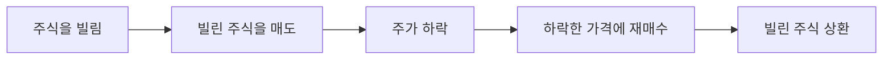

# 공매도란 무엇이고 왜 논란인가

뉴스에서 "공매도 금지", "공매도 재개" 같은 말을 본 적 있으신가요. 그런데 정작 "내가 갖고 있지 않은 걸 어떻게 팔지?"라는 질문에는 답이 잘 안 나와요. 이 글은 공매도가 실제로 어떻게 이뤄지는지, 왜 그렇게 오랫동안 논쟁거리인지를 처음부터 정리해요.

## 핵심 답변

**공매도는 내가 갖고 있지 않은 주식을 다른 사람에게 빌려서 먼저 팔고, 나중에 그 주식을 시장에서 사서 빌린 사람에게 돌려주는 거래예요. 빌릴 때보다 되살 때 주가가 내려가야 그 차액만큼 이익이 나요.** 보통의 투자가 "싸게 사서 비싸게 팔기"를 노린다면, 공매도는 반대로 "비싸게 팔고 싸게 사기"를 노리는 셈이에요.

## 어떻게 작동하나

공매도는 다음 다섯 단계로 이뤄져요. 증권사를 통해 다른 투자자나 **기관투자자**(자산운용사·보험사·연기금처럼 법인 자격으로 큰 규모의 자금을 굴리는 투자자예요. [2-4](2-4-ipo-subscription.md)에서 더 자세히 다뤄요)로부터 주식을 빌리는 절차가 먼저 있고, 그 뒤부터는 [1-3](../part1-basics/1-3-how-to-buy-stocks.md)에서 다룬 보통의 매도 주문·매수 주문과 똑같은 방식으로 거래가 체결돼요.

돈의 흐름으로 보면 이래요. ① 주식을 빌리는 단계에서는 아직 돈이 오가지 않고, 다만 빌린 대가로 이자 성격의 수수료를 내기로 약속해요. ② 빌린 주식을 시장에 팔면 그 판매 대금이 내 계좌로 들어와요. ③ 이후 주가가 내려가길 기다려요. ④ 원하는 시점에 시장에서 같은 수량의 주식을 사요. 이때 낸 돈이 ②에서 받은 돈보다 적으면 그 차액이 이익이 돼요. ⑤ 사들인 주식을 원래 빌려준 사람에게 그대로 돌려주는 걸 **상환**이라고 해요. 만약 ④의 재매수 가격이 ②의 매도 가격보다 오히려 높다면, 그 차액만큼 손실을 보게 돼요.

## 차입공매도와 무차입공매도

공매도는 주식을 어떻게 확보하고 파느냐에 따라 둘로 나뉘어요.

**차입공매도**는 위에서 본 것처럼 다른 사람에게 주식을 먼저 빌린 다음, 그 빌린 주식을 파는 방식이에요. 팔 때 이미 손에 그 주식이 있는 상태라서, 나중에 상환할 물량 자체는 확보돼 있어요.

**무차입공매도**는 주식을 빌리지도 않은 상태에서 먼저 팔아버리는 거예요. 파는 시점에는 존재하지도 않는 주식을 파는 셈이라, **결제일**(주문이 체결된 뒤 실제로 주식과 대금을 주고받아 소유권을 확정 짓는 날이에요. 국내 주식은 매매일을 포함해 3영업일이 걸리고 흔히 T+2라고 불러요. [2-3](2-3-dividend-basics.md)에서 더 자세히 다뤄요)까지 실제로 주식을 구해 오지 못하면 매매가 정상적으로 끝나지 않을 위험이 생겨요. 이 때문에 무차입공매도는 국내 자본시장법상 원칙적으로 금지돼 있고, 적발되면 처벌 대상이 돼요.

## 왜 논란인가

공매도는 한국에서 개인 투자자와 기관 사이의 오랜 쟁점이에요. 양쪽 주장을 각각 사실로만 정리하면 이래요.

**지지하는 쪽이 말하는 근거**는 크게 두 가지예요. 하나는 **가격 발견 기능**이에요. 어떤 회사의 주가가 실적이나 재무 상태에 비해 지나치게 높게 형성돼 있다고 볼 때, 공매도는 그 판단을 매도 주문으로 실현시켜서 주가가 실제 가치에 더 가깝게 조정되도록 돕는다고 봐요. 다른 하나는 **유동성**(시장에서 사고팔려는 주문이 얼마나 활발히 오가는지를 뜻해요) 공급이에요. 공매도 참여자가 늘어나면 매도 주문도 늘어나서, 다른 투자자들이 원할 때 더 쉽게 거래 상대를 찾을 수 있다고 설명해요.

**비판하는 쪽이 말하는 근거**도 크게 두 가지예요. 하나는 개인과 기관 사이의 조건 차이예요. 기관이나 외국인 투자자는 주식을 빌릴 수 있는 물량과 조건에서 개인 투자자보다 유리한 위치에 있는 경우가 많다고 지적해요. 다른 하나는 무차입공매도의 실제 적발 사례예요. 금지된 방식임에도 국내외 기관의 무차입공매도가 여러 차례 적발돼 제재를 받은 사례가 있었고, 이 사례들이 제도 자체에 대한 불신으로 이어진다고 봐요.

이 글은 어느 쪽 주장이 옳은지 판단하지 않아요. 두 주장 모두 실제로 제기돼 온 논거라는 사실만 전달해요.

## 지금은 어떤 상태인가

공매도 제도는 한국에서 금지와 재개가 여러 차례 반복됐어요. 확인 가능한 가장 최근 공식 발표를 기준으로 보면, 금융위원회는 2023년 11월 6일부터 2024년 6월 30일까지 국내 증시 전 종목에 대해 공매도를 한시적으로 금지하기로 의결했고, 이후 제도 개선 작업이 이어지면서 금지 기간을 2025년 3월 30일까지 한 차례 연장했어요. 그 사이 무차입공매도를 사후에 적출해내는 전산 감시 시스템(NSDS)을 개발해 3월 27일까지 모의가동을 거치며 점검을 마쳤고, **2025년 3월 31일부터 모든 상장주식을 대상으로 공매도를 전면 재개**한다고 밝혔어요.

다만 이 내용은 **2025년 3월 기준**으로 확인된 발표일 뿐이고, 이 글을 쓰는 2026년 7월 시점까지 추가로 규정이 바뀌었을 가능성을 배제할 수 없어요. 공매도 제도는 지금까지도 계속 손질돼 온 영역이라, 실제 투자 전에는 반드시 **금융위원회**(fsc.go.kr)나 **한국거래소**(krx.co.kr) 공식 발표로 현재 시행 중인 규정을 다시 확인하세요.

## 예시로 이해하기

가상 회사 **B화학**의 주가가 **10,000원**이라고 해봐요. 투자자가 이 주식 100주를 빌려서 즉시 시장에 팔면, 매도 대금으로 100주 × 10,000원 = **1,000,000원**이 들어와요. (빌린 대가로 내는 수수료는 계산을 간단히 하기 위해 여기서는 빼고, 매매 차익만 봐요.)

**이익이 나는 경우**: 이후 B화학 주가가 **8,000원**으로 내려갔다고 해봐요. 이때 100주를 되사면 100주 × 8,000원 = 800,000원이 들어요. 산 주식 100주를 그대로 상환하면, 받았던 1,000,000원에서 재매수에 쓴 800,000원을 뺀 **200,000원**이 이익이 돼요.

**손실이 나는 경우**: 반대로 B화학 주가가 **12,000원**으로 올랐다고 해봐요. 그래도 빌린 100주는 갚아야 하니 100주 × 12,000원 = 1,200,000원을 주고 되사야 해요. 받았던 1,000,000원에서 1,200,000원을 뺀 **-200,000원**, 즉 20만 원 손실이에요.

여기서 중요한 비대칭이 하나 있어요. 이익이 나는 쪽은 최대치가 정해져 있어요. 주가가 이론상 내려갈 수 있는 가장 낮은 값은 0원이라서, 아무리 잘 풀려도 이익은 처음 받은 매도 대금인 1,000,000원을 넘을 수 없어요. 하지만 손실이 나는 쪽은 다르죠. 주가가 12,000원이 아니라 20,000원, 50,000원, 그 이상으로 오른다면 되사는 데 드는 돈도 그만큼 계속 늘어나요. 주가가 오를 수 있는 한계에는 정해진 상한이 없기 때문에, 공매도의 손실에는 이론상 한계가 없어요. 이익은 제한돼 있지만 손실은 그렇지 않다는 이 차이가, 공매도가 일반 매매보다 위험이 크다고 이야기되는 이유예요.

## 한 줄 정리

공매도는 주식을 빌려서 먼저 팔고 나중에 싸게 사서 갚는 거래로, 주가가 내려야 이익이 나고 오히려 오르면 손실이 나는데 그 손실에는 이론상 한계가 없어요. 국내에서는 빌리지 않고 파는 무차입공매도가 금지돼 있고, 제도 자체는 가격 발견·유동성 공급이라는 지지 논거와 개인·기관 간 조건 차이·불법 적발 사례라는 비판 논거가 함께 있는 채로 금지와 재개를 반복해 왔어요. 2026년 7월 기준으로 이 글에 정리한 내용은 시간이 지나며 바뀔 수 있으니, 실제 현황은 금융위원회·한국거래소 공식 발표로 다시 확인하세요.

---

> 이 글은 투자 판단에 도움이 되는 일반적인 정보를 제공할 뿐, 특정 종목이나 상품의 매매를 권유하지 않아요. 제도와 세금은 바뀔 수 있으니 실제 투자 전에는 최신 내용을 다시 확인하세요.

> 함께 보면 좋은 글
> - [1-1. 주식이란 무엇인가 — 회사 지분을 산다는 것의 의미](../part1-basics/1-1-what-is-stock.md)
> - [1-3. 주식 사는 법 — 호가창, 시장가/지정가 주문 이해하기](../part1-basics/1-3-how-to-buy-stocks.md)
> - [2-1. 코스피 vs 코스닥, 뭐가 다른가](2-1-kospi-vs-kosdaq.md)
> - [2-6. 상한가·하한가·서킷브레이커 — 시장의 안전장치](2-6-price-limit-circuit-breaker.md)
