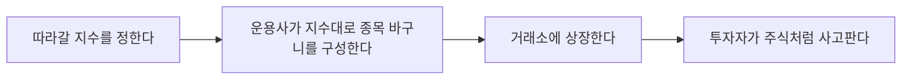

# ETF란 무엇인가 — 펀드와 뭐가 다른가

[3-6. 미국 배당주와 배당 성장 투자](../part3-us-overseas/3-6-us-dividend-investing.md)를 닫으면서 "이제 개별 종목이 아니라 시장 전체를 통째로 사는 방법"을 보자고 했어요. 그 방법이 바로 **ETF**예요. 이름은 자주 들어봤는데 펀드인지 주식인지 헷갈리는 분들이 많은데, 이 글에서 정체부터 정리할게요.

## 핵심 답변

**ETF는 여러 종목을 담은 바구니를 통째로, 주식처럼 거래소에서 사고파는 상품이에요.**

정식 이름은 **상장지수펀드**(Exchange Traded Fund)예요. 이름을 뜯어보면 성격이 그대로 나와요.

- **펀드** — 여러 사람의 돈을 모아 여러 종목에 나눠 담는 상품이에요
- **지수** — 보통 [2-2](../part2-korea-market/2-2-how-kospi-index-works.md)에서 본 코스피 지수처럼, 시장 흐름을 재는 지수를 그대로 따라가도록 바구니를 짜요
- **상장** — 그 바구니 자체를 거래소에 올려서, 주식 1주 사듯 사고팔 수 있게 만들었어요

즉 **펀드인데 주식처럼 거래된다**는 게 ETF의 전부예요. 한 주만 사도 그 안에 든 수십, 수백 개 종목에 나눠 투자한 셈이 돼요.

## 펀드와 무엇이 다른가

ETF도 펀드지만 사고파는 방식이 완전히 달라요. 일반 펀드와 나란히 놓고 보면 차이가 분명해져요.

| | 일반 펀드 | ETF |
|---|---|---|
| 어디서 사나 | 은행·증권사 창구나 앱의 펀드 메뉴 | **증권계좌에서 주식처럼** |
| 가격이 정해지는 시점 | 하루에 한 번 정해지는 기준가 | **거래 중 실시간으로 계속** |
| 사고파는 방법 | 매수·환매 신청 후 며칠 뒤 처리 | [1-3](../part1-basics/1-3-how-to-buy-stocks.md)의 호가창에서 즉시 주문 |
| 최소 투자금액 | 상품마다 정해진 최소 금액 | **1주 가격만 있으면 가능** |
| 지금 얼마인지 확인 | 다음 날 기준가 발표를 기다림 | 실시간 확인 |

가장 크게 와닿는 차이는 **가격이 정해지는 시점**이에요. 일반 펀드는 오늘 사겠다고 신청해도 그날 장이 끝난 뒤 계산된 기준가 하나로 처리돼요. 내가 얼마에 샀는지 살 때는 몰라요. 반면 ETF는 [1-3. 주식 사는 법](../part1-basics/1-3-how-to-buy-stocks.md)에서 본 호가창에 값이 실시간으로 떠 있어서, 보고 있는 그 값에 바로 주문을 넣을 수 있어요.

## ETF는 어떻게 만들어지나

바구니가 어떻게 만들어져 거래소까지 오는지 흐름으로 보면 이해가 빨라요.

여기서 [1-1. 주식이란 무엇인가](../part1-basics/1-1-what-is-stock.md)에서 본 구분이 다시 나와요. 회사가 주식을 새로 발행해 파는 **발행시장**과, 이미 발행된 주식을 투자자끼리 주고받는 **유통시장**이 나뉜다고 했죠. ETF도 똑같아요.

- **발행시장** — 운용사가 바구니를 새로 만들거나(설정) 없애는(환매) 단계예요. 여기는 **지정참가회사**라고 부르는 증권사들이 참여하고, 개인 투자자는 들어갈 수 없어요
- **유통시장** — 우리가 앱에서 ETF를 사고파는 곳이에요. **개인은 여기서만 거래해요**

그래서 개인이 ETF를 팔 때는 운용사에 "돈으로 돌려달라"고 하는 게 아니라, 그냥 **시장에서 다른 투자자에게 파는** 거예요. 주식과 똑같죠.

여기서 궁금해지는 게 있어요. **"내가 팔고 싶은데 사줄 사람이 없으면 어떡하지?"** 그래서 ETF에는 **유동성공급자**(LP)가 붙어요. 거래가 뜸한 종목에도 사겠다·팔겠다는 값을 계속 대주는 증권사예요. 덕분에 거래량이 적은 ETF도 어느 정도는 사고팔 수 있어요.

## 순자산가치와 시장가격

ETF에는 값이 두 개 있어요. 이게 초보가 가장 헷갈리는 지점이에요.

- **순자산가치**(NAV) — 바구니 안에 실제로 든 자산을 지금 시세로 평가한 뒤, 운용보수 같은 비용을 빼고 주식 수로 나눈 값이에요. **바구니의 진짜 값**이죠
- **시장가격** — 거래소에서 사람들이 실제로 사고파는 값이에요. [1-1](../part1-basics/1-1-what-is-stock.md)에서 본 것처럼 사겠다는 사람과 팔겠다는 사람 사이에서 정해져요

둘은 대체로 비슷하게 움직이지만 **똑같지는 않아요.** 사려는 사람이 몰리면 시장가격이 순자산가치보다 높아지고, 반대면 낮아져요. 이 벌어진 정도를 **괴리율**이라고 부르는데, 상품을 고를 때 봐야 할 중요한 숫자예요. 이건 [4-3. ETF 고르는 법](4-3-how-to-choose-etf.md)에서 자세히 다룰게요.

지금 단계에서는 **"ETF 화면에 뜨는 가격이 곧 바구니의 실제 값은 아니다"** 정도만 알아두면 충분해요.

## 분배금

바구니 안에 든 종목들이 배당을 주면 그 돈이 ETF로 모여요. 운용사는 이걸 모아뒀다가 투자자에게 나눠주는데, 이걸 **분배금**이라고 해요.

[1-1](../part1-basics/1-1-what-is-stock.md)에서 배당은 "회사가 그동안 쌓아온 이익 가운데 일부를 주주에게 나눠주는 돈"이라고 했죠. 분배금은 그 배당이 ETF를 한 번 거쳐서 나오는 것이라고 보면 돼요.

다만 모든 ETF가 분배금을 주는 건 아니에요. 배당을 받아서 **다시 바구니에 넣어 굴리는** 상품도 있어요. 어느 쪽이 나은지는 상황에 따라 다르고, 이 구분도 [4-3](4-3-how-to-choose-etf.md)에서 다뤄요.

## 예시로 이해하기 — 30만원으로 200개 종목에 투자하기

가상의 상품 **A운용사 코스피200 ETF**가 1주에 **30,000원**이라고 해볼게요. 코스피200은 코스피 시장의 대표 종목 200개를 담은 지수예요.

**이 ETF를 10주 사면 300,000원**이 들어요. 그리고 그 30만원은 200개 종목에 지수 비중대로 나눠 담긴 셈이 돼요.

**같은 걸 개별 종목으로 직접 하려면 어떨까요.** 200개 종목을 1주씩만 사도, 종목당 평균 주가가 50,000원이라고 가정하면 이렇게 돼요.

- 200개 종목 × 50,000원 = **10,000,000원**

30만원이 아니라 **1,000만원**이 필요해요. 게다가 문제가 하나 더 있어요. **1주씩 똑같이 사는 건 지수를 제대로 따라가는 게 아니에요.** [2-2](../part2-korea-market/2-2-how-kospi-index-works.md)에서 봤듯 코스피 지수는 시가총액이 큰 종목의 영향력이 더 크게 반영되는 방식이라, 큰 회사는 많이 작은 회사는 적게 담아야 지수와 비슷하게 움직여요. 그 비중을 개인이 일일이 맞추고, 종목이 바뀔 때마다 조정하는 건 사실상 불가능해요.

**ETF는 이 일을 대신 해주고 대가로 보수를 받아요.** 얼마를 떼는지, 그리고 그게 장기적으로 얼마나 큰 차이를 만드는지는 [4-2. 인덱스 투자](4-2-index-investing.md)와 [4-3. ETF 고르는 법](4-3-how-to-choose-etf.md)에서 이어서 볼게요.

## 한 줄 정리

ETF는 여러 종목을 담은 바구니를 통째로, 주식처럼 거래소에서 실시간으로 사고파는 상품이에요. 일반 펀드와 달리 호가창에서 바로 주문할 수 있고 1주 값만 있으면 시작할 수 있어요. 바구니의 진짜 값(순자산가치)과 시장에서 거래되는 값은 서로 다를 수 있고, 안에 든 종목의 배당은 분배금으로 나와요.

---

> 이 글은 투자 판단에 도움이 되는 일반적인 정보를 제공할 뿐, 특정 종목이나 상품의 매매를 권유하지 않아요. 제도와 세금은 바뀔 수 있으니 실제 투자 전에는 최신 내용을 다시 확인하세요.

> 함께 보면 좋은 글
> - [1-1. 주식이란 무엇인가 — 회사 지분을 산다는 것의 의미](../part1-basics/1-1-what-is-stock.md)
> - [1-3. 주식 사는 법 — 호가창, 시장가/지정가 주문 이해하기](../part1-basics/1-3-how-to-buy-stocks.md)
> - [2-2. 코스피 지수는 어떻게 계산되나](../part2-korea-market/2-2-how-kospi-index-works.md)
> - [4-2. 인덱스 투자 — 왜 "시장을 사라"고 하는가](4-2-index-investing.md)
> - [4-3. ETF 고르는 법 — 운용보수, 괴리율, 추적오차](4-3-how-to-choose-etf.md)
