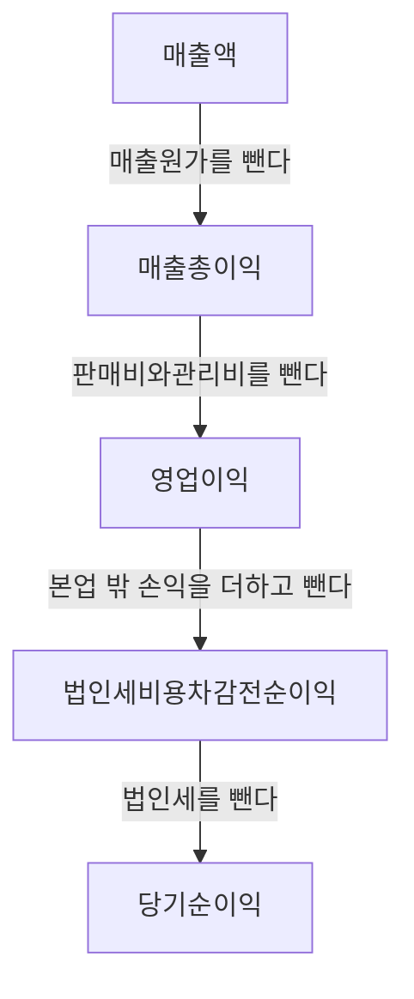

# 매출·영업이익·순이익, 손익계산서 읽기

뉴스에서 이런 문장을 본 적 있을 거예요. **"매출은 사상 최대인데 영업이익은 30% 감소했다."** 또는 **"영업이익은 줄었지만 순이익은 늘었다."**

처음 보면 모순처럼 읽혀요. 많이 팔았는데 왜 못 벌었다는 거고, 못 벌었다면서 왜 남은 돈은 늘었다는 걸까요. **저 문장들이 모순이 아닌 이유는 "이익"이라는 단어가 손익계산서 안에서 최소 세 번 다른 뜻으로 등장하기 때문이에요.**

[5-1](5-1-how-to-read-dart.md)에서 손익계산서를 "그 기간에 얼마를 벌어 얼마가 남았나"에 답하는 서류로 소개했죠. 이 글에서 그 표를 한 줄씩 읽어볼게요.

## 핵심 답변

**손익계산서는 맨 위 매출에서 아래로 내려가며, 무엇을 얼마나 빼는지 단계별로 보여주는 표예요.**

내려가는 도중에 이름이 다른 "이익"이 여러 번 나와요. **어느 단계의 이익이냐에 따라 뜻이 완전히 달라요.**

- **매출총이익** — 물건을 만들거나 사 오는 데 든 돈만 뺀 것
- **영업이익** — 거기서 파는 데 든 돈과 회사 운영비까지 뺀 것. **본업으로 번 돈**
- **당기순이익** — 본업 밖의 일과 세금까지 전부 정리하고 **최종적으로 남은 것**

그래서 "이익이 늘었다"는 말은 **어느 이익인지 밝히지 않으면 반쪽짜리 정보예요.**

## 위에서 아래로 내려가기

한국 상장회사들이 쓰는 회계기준(K-IFRS)에서 손익계산서는 대체로 이런 순서로 내려가요.

각 단계에서 빠지는 게 무엇인지 보면 이름의 뜻이 바로 이해돼요.

| 단계 | 여기서 빠지는 것 | 무엇을 뜻하나 |
|---|---|---|
| **매출액** | — | 물건이나 서비스를 팔아 들어온 돈 |
| **매출원가** | 만들거나 사 오는 데 든 돈 | 재료비, 공장 인건비 등 |
| **= 매출총이익** | | 팔 물건을 마련하고 남은 돈 |
| **판매비와관리비** | 파는 데 든 돈 + 회사 운영비 | 광고비, 영업 인건비, 사무실 비용 등 |
| **= 영업이익** | | **본업으로 번 돈** |
| **본업 밖 손익** | 이자, 환율, 자산 처분 등 | 더해지기도 빼지기도 해요 |
| **= 법인세비용차감전순이익** | | 세금 내기 직전의 이익 |
| **법인세비용** | 세금 | |
| **= 당기순이익** | | **최종적으로 남은 것** |

**참고로 정식 명칭은 「포괄손익계산서」예요.** 당기순이익 아래에 「기타포괄손익」이라는 항목이 한 겹 더 붙거든요. 아직 실제로 사고팔지 않아 확정되지 않은 평가 손익 같은 게 들어가는 자리인데, 초보 단계에서는 **당기순이익까지만 봐도 충분해요.**

## 영업이익과 순이익이 왜 다른가

여기가 이 글의 중심이에요. 두 이익 사이에는 **본업과 상관없는 것들**이 끼어 있어요.

- **이자** — 빌린 돈이 있으면 이자를 내고, 여유 자금을 예치했으면 이자를 받아요
- **환율** — 외화로 받을 돈이나 갚을 돈이 있으면 환율이 움직일 때마다 손익이 생겨요
- **자산을 팔아 생긴 손익** — 쓰던 땅이나 건물, 지분을 팔면 그 차익이 여기로 들어와요
- **손상차손** — 갖고 있는 자산의 값어치가 떨어졌다고 판단되면 그만큼 비용으로 털어내요

**이 항목들의 공통점은 "매년 똑같이 일어나는 일이 아니다"라는 거예요.** 땅을 파는 건 올해 한 번뿐이고, 환율이 유리하게 움직인 것도 내년엔 반대일 수 있어요.

그래서 두 이익을 이렇게 읽으면 돼요.

> **영업이익은 "이 회사가 하는 일이 얼마나 잘되고 있나", 당기순이익은 "그래서 올해 최종적으로 얼마가 남았나"예요.**

**둘 중 하나만 봐서는 안 되는 이유가 여기 있어요.**

영업이익만 보면 회사가 빚에 눌려 이자로 다 나가고 있어도 안 보여요. 반대로 당기순이익만 보면 **본업이 나빠졌는데 땅을 팔아 메운 해**도 "이익이 늘었다"로 읽혀요.

**특히 두 번째가 위험해요.** [5-2](5-2-per.md)에서 본 PER은 분모에 순이익을 써요. 일회성 이익으로 순이익이 부풀면 PER이 뚝 떨어지고, 화면상으로는 갑자기 싸 보이거든요. 하지만 그 이익은 내년에 다시 오지 않아요. **PER이 낮은 회사를 봤을 때 손익계산서를 열어 "이 순이익이 본업에서 나온 건가"를 확인해야 하는 이유예요.**

## 지배주주순이익 — 지표가 실제로 쓰는 숫자

당기순이익 아래에 한 줄이 더 있어요. 처음 보면 왜 있는지 모를 항목인데, **[5-2](5-2-per.md)와 [5-3](5-3-pbr-roe.md)의 지표가 실제로 쓰는 숫자가 이거예요.**

[5-1](5-1-how-to-read-dart.md)에서 **연결재무제표**는 회사와 자회사들을 하나인 것처럼 합쳐 만든다고 했죠. 그런데 여기서 문제가 생겨요. **자회사 지분을 100% 갖고 있지 않다면, 합쳐놓은 이익 중 일부는 내 몫이 아니에요.**

예를 들어 자회사 지분을 70%만 갖고 있다면 그 자회사가 번 돈의 30%는 나머지 주주들 것이에요. 그래서 연결손익계산서는 당기순이익을 둘로 나눠 적어요.

| 항목 | 누구 몫인가 |
|---|---|
| **지배기업 소유주지분** | 우리가 주식을 산 그 회사의 주주 몫 |
| **비지배지분** | 자회사의 다른 주주들 몫 |

**투자자에게 의미 있는 건 앞의 것이에요.** 흔히 **지배주주순이익**이라고 부르고, [5-2](5-2-per.md)의 EPS와 [5-3](5-3-pbr-roe.md)의 ROE 계산에 들어가는 것도 이 값이에요.

이걸 모르면 실수하기 쉬워요. **연결 당기순이익 전체를 주식 수로 나누면 EPS가 실제보다 크게 나오고, 따라서 PER은 실제보다 작게 나와요.** 자회사를 여럿 거느린 회사일수록 이 차이가 커져요.

## 매출이 늘었는데 이익이 줄었다면

맨 앞에서 꺼낸 뉴스 문장으로 돌아와볼게요. 매출이 늘었는데 영업이익이 줄었다면, 중간에서 뭔가가 더 크게 늘었다는 뜻이에요. **어디서 새고 있는지는 비율로 보면 단계별로 짚을 수 있어요.**

> **매출총이익률 = 매출총이익 ÷ 매출액 × 100 (%)**
>
> **영업이익률 = 영업이익 ÷ 매출액 × 100 (%)**

두 비율을 작년과 나란히 놓으면 원인이 어느 단계인지 갈려요.

- **매출총이익률이 떨어졌다면** — 만들거나 사 오는 원가가 올랐다는 뜻이에요. 원자재값이 뛰었거나, 값을 깎아 팔았거나
- **매출총이익률은 그대로인데 영업이익률만 떨어졌다면** — 원가는 그대로인데 **파는 데 돈을 더 썼다**는 뜻이에요. 광고를 늘렸거나 인건비가 올랐거나

**금액이 아니라 비율로 봐야 보인다는 게 핵심이에요.** 매출이 20% 늘면 이익 금액도 대체로 같이 늘어서, 금액만 보면 "늘었네" 하고 넘어가게 되거든요. 비율로 보면 **덩치는 커졌는데 남는 게 얇아진** 상황이 드러나요.

## 2027년부터 손익계산서 모양이 바뀌어요

**지금까지 설명한 구조는 곧 바뀔 예정이에요.** 새 회계기준인 **K-IFRS 제1118호**가 손익계산서 표시 방식을 다시 정했거든요 (2026년 8월 기준).

바뀌는 내용은 크게 둘이에요.

- **모든 수익과 비용을 다섯 범주로 나눠요** — 영업, 투자, 재무, 법인세, 중단영업. 그리고 금융위원회 설명에 따르면 범주별 중간합계를 표시하는 게 의무가 돼요
- **영업손익의 뜻이 넓어져요** — 지금은 "주된 영업활동과 관련된 손익"인데, 새 기준에서는 **"투자·재무 범주에 속하지 않는 나머지 전부"**로 바뀌어요. 지금은 본업 밖으로 밀려나 있던 항목 일부가 영업손익 안으로 들어온다는 뜻이에요

**언제부터인지가 중요해요.**

- **의무 적용** — 2027년 1월 1일 이후 시작하는 회계연도부터예요
- **조기적용** — **2026년 1월 1일 이후 시작하는 회계연도부터 이미 허용돼 있어요**

두 번째 줄 때문에 **"2027년 전에는 무조건 옛날 구조"라고 단정하면 안 돼요.** 먼저 적용하기로 한 회사가 있다면 지금 열어보는 보고서가 이미 새 구조일 수 있어요.

다만 비교가 통째로 끊기지는 않아요. **새 기준에서도 현행 방식으로 계산한 영업손익을 주석에 따로 적게 돼 있거든요.** 예전 숫자와 이어서 보고 싶으면 주석을 찾으면 돼요. (시행 3년 뒤에 이 병기를 계속할지 다시 검토할 예정이에요.)

**2026년 8월 기준으로, 지금 DART에서 열어보는 대부분의 보고서는 이 글에서 설명한 구조예요.** 다만 앞으로 몇 년 사이에 항목 이름과 순서가 달라 보이는 보고서를 만나게 될 테니, 그때 당황하지 마시라고 미리 적어둬요.

## 예시로 이해하기 — 영업이익은 그대로인데 순이익만 40% 넘게 빠지는 회사

가상의 회사 **E전자**의 1년치 손익계산서예요. 전부 가정한 숫자이고, 연결 기준이라고 할게요.

| 항목 | 금액 |
|---|---|
| 매출액 | 5,000억원 |
| 매출원가 | −3,500억원 |
| **매출총이익** | **1,500억원** |
| 판매비와관리비 | −1,000억원 |
| **영업이익** | **500억원** |
| 금융비용(이자) | −100억원 |
| 자산처분이익(공장 부지 매각) | +300억원 |
| **법인세비용차감전순이익** | **700억원** |
| 법인세비용 | −140억원 |
| **당기순이익** | **560억원** |
| ㄴ 지배기업 소유주지분 | 500억원 |
| ㄴ 비지배지분 | 60억원 |

**맨 위에서 아래까지 한 번에 따라가볼게요.**

5,000억 − 3,500억 = 1,500억 → 1,500억 − 1,000억 = 500억 → 500억 − 100억 + 300억 = 700억 → 700억 − 140억 = **560억원**. 법인세는 세전이익의 20%가 나갔네요.

**여기서 눈여겨볼 게 있어요. 당기순이익 560억원이 영업이익 500억원보다 커요.** 보통은 이자와 세금을 내고 나면 순이익이 영업이익보다 작아지는데, 이 회사는 반대예요. **공장 부지를 팔아 생긴 300억원 때문이에요.**

**그 매각이 없었다면 어땠을지 계산해볼게요.**

- 세전이익 = 700억 − 300억 = **400억원**
- 법인세를 같은 20%로 보면 = 80억원
- **당기순이익 = 320억원**

**영업이익 500억원은 그대로인데, 당기순이익만 560억원에서 320억원으로 바뀌어요.** 240억원, 약 43%가 사라지는 셈이죠.

이제 이 회사의 뉴스 헤드라인이 어떻게 나올지 상상해보세요. **"E전자, 순이익 전년 대비 대폭 증가"**라고 나올 수 있어요. 틀린 말은 아니에요. 하지만 **본업이 좋아져서가 아니라 땅을 팔아서**이고, 내년엔 팔 땅이 없어요.

**[5-2](5-2-per.md)의 PER로 넘어가면 문제가 더 선명해져요.** 이 회사 시가총액이 1조원이라고 가정할게요.

- 지배주주순이익 500억원으로 계산하면 — 10,000억 ÷ 500억 = **PER 20배**
- 연결 당기순이익 560억원을 그냥 쓰면 — 10,000억 ÷ 560억 = **PER 약 17.9배**

**어느 숫자를 분모에 넣느냐에 따라 같은 회사의 PER이 20배도 되고 17.9배도 돼요.** 그리고 일회성 매각까지 걷어내면 실제 본업 대비 배수는 훨씬 높아지고요.

**그래서 [5-1](5-1-how-to-read-dart.md)에서 말한 순서가 중요해요.** PER 같은 비율을 보기 전에 손익계산서를 먼저 열어야 해요. 순서를 뒤집으면 이런 회사가 "PER 17.9배, 순이익 급증"으로 보여요.

**마지막으로 하나 더요.** 이 회사가 560억원을 벌었다고 해서 주주가 560억원을 받는 건 아니에요. [1-1](../part1-basics/1-1-what-is-stock.md)에서 배당은 **회사가 쌓아온 이익 가운데 일부**를 나눠주는 것이라고 했죠. 나머지는 회사 안에 남아 다음 사업에 쓰여요. **순이익은 주주에게 지급된 돈이 아니라 회사가 벌어들인 돈이에요.**

## 한 줄 정리

손익계산서는 **매출액에서 아래로 내려가며 무엇을 얼마나 빼는지** 보여주는 표이고, 도중에 나오는 이익들은 서로 뜻이 달라요. **영업이익은 본업으로 번 돈, 당기순이익은 본업 밖 손익과 세금까지 정리하고 최종적으로 남은 돈**이에요. 순이익만 크다면 일회성 이익이 섞이지 않았는지 확인하세요.

연결 기준에서는 당기순이익 중 **지배기업 소유주지분**만이 우리 몫이고, [5-2](5-2-per.md)·[5-3](5-3-pbr-roe.md)의 지표도 이 값을 써요. 그리고 매출이 늘었는데 이익이 줄었다면 **금액이 아니라 비율**로 봐야 어느 단계에서 새는지 보여요.

---

> 이 글은 투자 판단에 도움이 되는 일반적인 정보를 제공할 뿐, 특정 종목이나 상품의 매매를 권유하지 않아요. 제도와 세금은 바뀔 수 있으니 실제 투자 전에는 최신 내용을 다시 확인하세요.

> 함께 보면 좋은 글
> - [1-1. 주식이란 무엇인가 — 회사 지분을 산다는 것의 의미](../part1-basics/1-1-what-is-stock.md)
> - [5-1. 재무제표, 어디서 보고 뭘 봐야 하나 (DART 사용법)](5-1-how-to-read-dart.md)
> - [5-2. PER — 이 주식은 비싼가 싼가](5-2-per.md)
> - [5-3. PBR과 ROE — 자산과 수익성으로 보는 기업](5-3-pbr-roe.md)
> - [5-5. 부채비율과 유동비율 — 망하지 않을 회사 고르기](5-5-debt-ratio.md)
> - [5-6. 가치평가의 한계 — 지표만 보면 안 되는 이유](5-6-limits-of-valuation.md)
