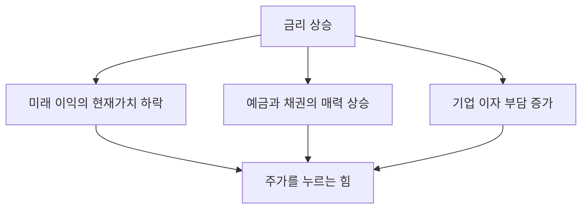

# 금리와 주가의 관계 — 왜 금리가 오르면 주가가 떨어지나

[5-6. 가치평가의 한계](../part5-analysis/5-6-limits-of-valuation.md)를 닫으면서 이렇게 넘겨뒀어요. **"회사가 그대로여도 시장 전체의 환경이 바뀌면 지표 수준도, 주가도 함께 움직인다"**고요.

그 환경의 대표 변수가 **금리**예요. 내가 가진 종목에 아무 일도 없었는데 어느 날 시장 전체가 같이 빠지고, 뉴스에는 "금리 인상 우려"라는 말만 나오는 날이 있죠. 이 글은 그 연결고리를 다뤄요.

다만 미리 밝혀둘 게 하나 있어요. **이 글은 "금리가 몇 %면 주식을 팔아라" 같은 답을 주지 않아요.** 금리가 주가를 어느 방향으로 미는지, 어떤 경로로 미는지까지가 이 글의 범위예요.

## 핵심 답변

**금리는 돈의 값이에요.**

돈을 빌리면 값을 치러야 하고, 빌려주면 값을 받아요. 그 값을 원금에 대한 비율로 나타낸 게 금리예요. 연 5%라면 100만원을 1년 빌리는 값이 5만원이라는 뜻이죠.

**그래서 금리가 바뀌면 세상 모든 돈의 값이 같이 바뀌어요.** 주식도 결국 돈으로 사는 것이니 영향을 받아요. 금리가 오르면 주가를 누르는 힘이 **세 갈래**로 생겨요.

| 경로 | 무슨 일이 일어나나 |
|---|---|
| **1. 미래의 돈이 싸진다** | 앞으로 벌 이익을 오늘 값으로 환산하면 더 적어져요 |
| **2. 안전한 대안이 매력적이 된다** | 예금·채권 이자가 오르면 위험을 질 이유가 줄어요 |
| **3. 회사의 이자 부담이 늘어난다** | 빌린 돈이 많은 회사일수록 이익이 깎여요 |

**여기서 가장 중요한 건 마지막 상자의 표현이에요. "누르는 힘이 생긴다"이지 "반드시 내린다"가 아니에요.** 실제로는 금리가 오르는데 주가도 오르는 국면이 흔해요. 왜 그런지는 아래 「그런데 항상 그렇지는 않아요」에서 따로 다룰게요. 그 절을 안 읽고 이 표만 외우면 오히려 손해예요.

## 경로 1 — 미래의 돈이 싸진다

**이 챕터의 중심이에요.** 그리고 셋 중 가장 덜 알려져 있는데 가장 크게 작동하는 경로예요.

질문 하나로 시작할게요. **오늘의 100만원과 1년 뒤의 100만원은 같은 가치인가요?**

같지 않아요. 오늘 100만원이 있으면 은행에 넣어 이자를 받을 수 있으니까요. 금리가 연 3%라면 1년 뒤에 103만원이 되죠. 뒤집어 말하면 **1년 뒤의 100만원은 오늘 기준으로 100만원보다 적은 값어치**예요. 얼마인지는 나눗셈으로 나와요.

> **현재가치 = 미래의 금액 ÷ (1 + 금리)의 기간 제곱**

1년 뒤 100만원을 금리 3%로 환산하면 100 ÷ 1.03 = 약 97.1만원이에요. 이렇게 **미래의 돈을 오늘 값으로 옮기는 것을 할인**이라고 하고, 여기 쓰이는 금리를 **할인율**이라고 불러요.

**핵심은 여기예요. 금리가 오르면 나누는 수가 커지니까 미래의 돈이 더 많이 깎여요.**

같은 100만원을 두 금리, 두 시점으로 계산해볼게요.

| | 금리 연 3% | 금리 연 6% | 얼마나 더 깎였나 |
|---|---|---|---|
| **1년 뒤** 100만원 | 약 97.1만원 | 약 94.3만원 | 약 2.8% |
| **10년 뒤** 100만원 | 약 74.4만원 | 약 55.8만원 | **약 25%** |

**같은 금리 변화인데 1년 뒤 돈은 3%도 안 깎이고, 10년 뒤 돈은 4분의 1이 깎였어요.** 나누는 수가 기간만큼 거듭제곱되기 때문이에요.

**그래서 이런 결론이 나와요. 먼 미래의 이익에 기대는 회사일수록 금리에 더 흔들려요.**

[5-2. PER](../part5-analysis/5-2-per.md)에서 **PER이 높은 건 비싸서가 아니라 앞으로 이익이 크게 늘 거라는 기대가 주가에 먼저 얹혔기 때문인 경우가 많다**고 했죠. 그 기대의 상당 부분은 **먼 미래의 이익**이에요. 그러니 금리가 오르면 그 부분이 가장 크게 깎여요. 지금 당장 꼬박꼬박 이익을 내는 회사는 상대적으로 덜 흔들리고요.

**뉴스에서 "금리가 오르자 성장주가 더 많이 빠졌다"고 할 때의 구조가 정확히 이거예요.**

한 가지 못 박고 갈게요. **이 계산은 주가를 구하는 식이 아니에요.** 미래의 돈이 금리에 따라 얼마나 다르게 보이는지를 재본 것뿐이고, 실제 주가는 이 값으로 정해지지 않아요. 그 이유는 아래 「한 줄 정리」에서 다시 확인할게요.

## 경로 2 — 안전한 대안이 매력적이 된다

이건 훨씬 직관적이에요.

주식을 사는 이유는 **원금을 잃을 수도 있는 위험을 지는 대신 더 큰 수익을 기대**하기 때문이에요. 그런데 예금이나 채권처럼 훨씬 안전한 곳에서 주는 이자가 올라가면 어떻게 될까요.

**굳이 위험을 질 이유가 줄어들어요.**

금리가 아주 낮을 때는 "예금에 넣어봐야 이자가 얼마 안 되니 주식이라도"라는 판단이 자연스러워요. 반대로 금리가 높아지면 "가만히 둬도 이만큼 주는데 굳이"가 되고요. 같은 사람이 같은 성향인데도 **비교 대상이 달라져서 판단이 바뀌는 거예요.**

**채권**은 정부나 회사가 돈을 빌리면서 써주는 차용증이에요. 정해진 기간에 정해진 이자를 주고 만기에 원금을 돌려주기로 한 증서인데, 이것도 시장에서 사고팔 수 있어요. 금리가 오르면 새로 나오는 채권이 더 높은 이자를 주니 채권의 매력도 함께 올라가요.

이 경로는 **투자자의 돈이 실제로 이동**하게 만들기 때문에 시장에 바로 나타나요.

## 경로 3 — 회사의 이자 부담이 늘어난다

앞의 두 경로가 **투자자 쪽** 이야기였다면, 이건 **회사 쪽** 이야기예요.

[5-5. 부채비율과 유동비율](../part5-analysis/5-5-debt-ratio.md)에서 봤듯 회사는 자기 돈만으로 굴러가지 않아요. 빌린 돈이 섞여 있고, 그 돈에는 이자가 붙어요. 부채비율은 **부채총계를 자본총계로 나눈 값**으로, 남의 돈이 내 돈의 몇 배인지를 보여주죠.

금리가 오르면 그 이자가 늘어나요. 그리고 5-5에서 짚은 것처럼 **이익은 줄어도 이자는 그대로**예요. 매출이 반토막 나도 은행이 이자를 깎아주지는 않으니까요.

**그래서 빌린 돈이 많은 회사일수록 금리에 민감해요.** 같은 폭의 금리 인상이어도 빚이 거의 없는 회사는 별 영향이 없고, 빚에 크게 기대는 회사는 이익이 눈에 띄게 깎여요.

여기에 한 겹이 더 있어요. **이자가 비싸지면 회사는 새 투자를 미뤄요.** 공장을 짓거나 사람을 더 뽑는 일을 다음으로 넘기죠. 그러면 앞으로의 이익 성장도 함께 느려져요. 개인도 마찬가지라서 대출 이자가 오르면 소비를 줄이고, 그게 다시 회사 매출로 돌아와요.

## 그런데 항상 그렇지는 않아요

**여기가 이 글에서 가장 중요한 절이에요.** 위 세 경로만 읽고 "금리가 오르면 주가가 내린다"를 공식으로 만들면, 그건 틀린 이해예요.

**첫째, 금리가 오르는데 주가도 오르는 국면이 흔해요.**

금리를 왜 올리는지 생각해보면 알 수 있어요. **경기가 좋아서 올리는 경우**가 많거든요. 사람들이 돈을 잘 쓰고 물가가 오르니 열기를 식히려고 올리는 거죠. 그런데 경기가 좋다는 건 **회사들이 돈을 더 잘 번다**는 뜻이기도 해요.

그러면 두 힘이 부딪혀요. **할인율이 올라 미래 이익의 값을 깎는 힘**과 **그 미래 이익 자체가 커지는 힘**이요. 뒤쪽이 이기면 금리가 올라도 주가는 올라가요. 실제로 금리 인상기에 주가가 함께 오른 구간은 여러 번 있었어요.

반대 경우도 있어요. 경기가 나빠서 금리를 내리는데 주가도 같이 빠지는 국면이요. **"금리를 내린다"는 건 "내릴 만큼 상황이 나쁘다"는 신호이기도 하니까요.**

**둘째, 시장은 예상된 금리를 이미 가격에 반영해 뒀어요.**

이건 훨씬 덜 알려져 있는데 실전에서는 더 중요해요. 금리를 결정하는 회의 날짜는 미리 공개돼 있고, 그 자리에서 어떤 결정이 나올지 시장은 계속 예상하고 있어요. **그 예상이 이미 지금 주가에 들어가 있어요.**

그래서 이런 일이 벌어져요.

- 금리를 올렸는데 주가가 **오르는** 경우 — 시장이 더 큰 폭을 예상하고 있었을 때
- 금리를 동결했는데 주가가 **빠지는** 경우 — 시장이 인하를 예상하고 있었을 때

**즉 움직임을 만드는 건 "금리를 올렸다"는 사실 자체가 아니라 "예상과 얼마나 달랐는가"예요.** 이게 경제 뉴스를 읽을 때 가장 자주 헷갈리는 지점이라 [6-6. 경제 뉴스 읽는 법](6-6-reading-economic-news.md)에서 따로 한 절을 들여 다뤄요.

**이 두 가지 때문에 "금리 인상"이라는 뉴스 한 줄만 보고 매매하는 건 근거가 되지 못해요.** 같은 뉴스가 국면에 따라 정반대 결과로 이어지거든요.

## 누가 금리를 정하나

우리가 뉴스에서 보는 "금리"는 대개 **기준금리**를 말해요.

**기준금리는 중앙은행이 정하는 정책금리예요.** 한국은 **한국은행**의 **금융통화위원회**가 정하고, 미국은 **연방준비제도**의 **연방공개시장위원회**(FOMC)가 정해요. 두 곳 모두 **정기 회의를 연 8회** 여는 일정으로 운영해요(2026년 8월 기준). 나머지 날에는 회의가 없으니, 금리 결정은 1년에 여덟 번씩만 일어나는 예정된 이벤트인 셈이에요.

**여기서 흔한 오해를 하나 풀고 갈게요. 기준금리는 내 예금·대출 금리와 같은 숫자가 아니에요.**

기준금리는 **출발점**이에요. 한국은행 설명에 따르면 기준금리가 바뀌면 아주 짧은 기간의 시장금리가 먼저 움직이고, 이어서 은행의 예금·대출 금리와 만기가 긴 금리들이 대체로 따라 움직여요. 이렇게 시장에서 실제로 거래되며 형성되는 금리를 **시장금리**라고 불러요.

**그런데 "대체로"예요.** 은행 대출금리에는 은행의 조달 비용과 빌리는 사람의 신용도에 따른 가산분이 얹히고, 만기가 긴 금리에는 앞으로 금리가 어떻게 될지에 대한 시장의 예상이 들어가요. 그래서 **기준금리가 그대로여도 시장금리는 움직일 수 있고, 반대로 기준금리가 움직여도 내 대출금리는 덜 움직이거나 더 움직일 수 있어요.**

한국은행도 **기준금리 변경이 미치는 영향의 크기와 그 시차를 정확히 측정할 수는 없다**고 밝히고 있어요. 방향은 있지만 크기는 정해져 있지 않다는 뜻이에요.

**이 글에 현재 기준금리 수준을 적지 않은 것도 같은 이유예요.** 금리는 1년에 여덟 번 바뀔 수 있어서, 지금 숫자를 적어두면 이 글이 몇 달 만에 낡아요. 현재 수준은 한국은행 홈페이지에서 직접 확인하세요.

## 예시로 이해하기 — 같은 금리 변화, 정반대의 충격

가상의 두 회사예요. 전부 가정한 숫자예요.

| | **L전자** | **M테크** |
|---|---|---|
| 어떤 회사인가 | 지금 꾸준히 버는 회사 | 앞으로 크게 벌 거라 기대되는 회사 |
| 이익이 나오는 시점 | **1년 뒤** | **10년 뒤** |
| 기대되는 이익 | 100억원 | 100억원 |

**둘 다 기대되는 이익은 100억원으로 똑같아요.** 나오는 시점만 달라요.

이제 금리가 **연 3%에서 연 6%로 올랐다고 가정**하고, 두 회사가 기대하는 이익을 오늘 값으로 환산해볼게요.

**금리 연 3%일 때**

- L전자 = 100억 ÷ 1.03 = **약 97.1억원**
- M테크 = 100억 ÷ 1.03의 10제곱 = 100억 ÷ 1.344 = **약 74.4억원**

**금리 연 6%일 때**

- L전자 = 100억 ÷ 1.06 = **약 94.3억원**
- M테크 = 100억 ÷ 1.06의 10제곱 = 100억 ÷ 1.791 = **약 55.8억원**

나란히 놓아볼게요.

| | 금리 3%일 때 | 금리 6%일 때 | 변화 |
|---|---|---|---|
| L전자 | 약 97.1억원 | 약 94.3억원 | **약 −2.8%** |
| M테크 | 약 74.4억원 | 약 55.8억원 | **약 −25.0%** |

**두 회사에 아무 일도 일어나지 않았어요.** 제품도 그대로고, 직원도 그대로고, 기대되는 이익 100억원도 그대로예요. **바뀐 건 회사 바깥의 금리 하나뿐인데 M테크가 받은 충격이 L전자의 아홉 배쯤 돼요.**

이게 [5-6](../part5-analysis/5-6-limits-of-valuation.md)이 "회사가 그대로여도 시장 전체 환경이 바뀌면 지표 수준도 주가도 움직인다"고 한 말의 정체예요. 그리고 5-6이 「한계 3」에서 **금리가 낮을 때와 높을 때 시장 전체의 지표 수준이 달라진다**고 한 것도 같은 이야기예요. 금리가 낮은 시기에는 시장 전체의 PER이 높게 형성되는 경향이 있고, 금리가 높아지면 그 수준이 내려와요. **그래서 몇 년 전 PER과 지금 PER을 그냥 비교하면 안 되는 거예요.**

**두 가지는 반드시 짚고 넘어갈게요.**

**첫째, 위 계산은 주가가 아니에요.** 진짜 회사는 이익이 한 번만 나오지 않고 매년 나오고, 그 이익이 얼마일지도 아무도 몰라요. 위 예시는 **시점의 차이가 금리에 얼마나 다르게 반응하는지**만 떼어내 보여주려고 극단적으로 단순화한 것이고, **여기서 나온 숫자가 L전자나 M테크의 주가라는 뜻이 전혀 아니에요.**

**둘째, 그래서 "M테크를 팔아야 한다"는 결론도 나오지 않아요.** 금리가 다시 내려가면 같은 계산이 정반대로 작동하고, 앞에서 봤듯 **금리가 오르는 동안 M테크의 기대 이익 자체가 100억원보다 커질 수도** 있거든요.

## 한 줄 정리

금리는 **돈의 값**이라서 금리가 오르면 **미래 이익의 값이 깎이고, 안전한 대안이 매력적이 되고, 회사의 이자 부담이 늘어나요.** 그래서 주가를 누르는 힘이 생기고, 특히 **먼 미래의 이익에 기대는 회사일수록 크게 흔들려요.**

**하지만 "금리가 오르면 주가가 내린다"는 공식이 아니에요.** 경기가 좋아서 올리는 국면에서는 이익이 커지는 힘이 이길 수 있고, 무엇보다 **시장은 예상된 금리를 이미 가격에 반영해 뒀기 때문에 발표 자체보다 예상과의 차이가 움직임을 만들어요**([6-6](6-6-reading-economic-news.md)).

**그리고 이 글이 알려주지 않는 것을 마지막으로 확인할게요. 금리는 방향과 경로를 설명할 뿐, 적정한 주가를 계산해주지 않아요.** [1-1](../part1-basics/1-1-what-is-stock.md)에서 확정한 대로 주가는 회사 가치를 주식 수로 나눈 값이 아니라 기대가 얹혀 정해지는 가격이고, [5-6](../part5-analysis/5-6-limits-of-valuation.md)에서 확인한 대로 **어떤 숫자도 "이 주식의 제값은 얼마"라고 알려주지 않아요.** 금리가 1%포인트 오르면 주가가 얼마 내려간다는 식의 계산은 이 위키가 하지 않는 이유예요.

금리가 왜 오르내리는지, 그 뒤에 있는 **물가**는 무엇인지가 다음 질문이에요. [6-2. 인플레이션과 투자](6-2-inflation.md)에서 이어서 볼게요.

---

> 이 글은 투자 판단에 도움이 되는 일반적인 정보를 제공할 뿐, 특정 종목이나 상품의 매매를 권유하지 않아요. 제도와 세금은 바뀔 수 있으니 실제 투자 전에는 최신 내용을 다시 확인하세요.

> 함께 보면 좋은 글
> - [1-1. 주식이란 무엇인가 — 회사 지분을 산다는 것의 의미](../part1-basics/1-1-what-is-stock.md)
> - [5-2. PER — 이 주식은 비싼가 싼가](../part5-analysis/5-2-per.md)
> - [5-5. 부채비율과 유동비율 — 망하지 않을 회사 고르기](../part5-analysis/5-5-debt-ratio.md)
> - [5-6. 가치평가의 한계 — 지표만 보면 안 되는 이유](../part5-analysis/5-6-limits-of-valuation.md)
> - [6-2. 인플레이션과 투자 — 현금은 왜 녹는가](6-2-inflation.md)
> - [6-6. 경제 뉴스 읽는 법 — FOMC, CPI, 고용지표가 뭐길래](6-6-reading-economic-news.md)
