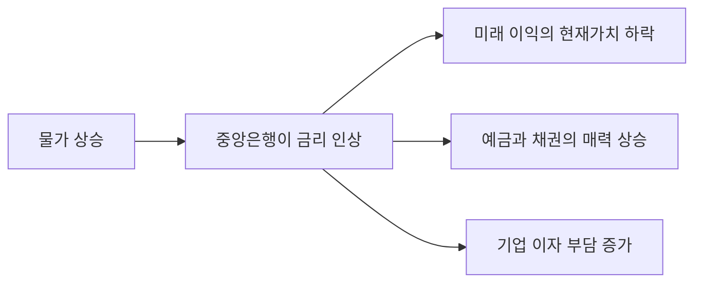

# 인플레이션과 투자 — 현금은 왜 녹는가

**통장 잔고는 그대로인데 살 수 있는 게 줄었다는 느낌**, 다들 한 번쯤 받아보셨을 거예요. 몇 년 전 5,000원이던 점심값이 이제 1만원이 됐는데 월급은 그만큼 오르지 않았죠.

[6-1. 금리와 주가의 관계](6-1-interest-rate-and-stocks.md)에서 금리가 오르는 이유 중 하나가 **경기가 좋아서, 물가가 올라서**라고 했어요. 그 물가 이야기를 이번 글에서 제대로 다룰게요.

**그리고 이 글의 결론을 먼저 말하면 이래요. 돈을 아무 데도 넣지 않는 것도 선택이고, 그 선택에도 대가가 있어요.**

## 핵심 답변

**물가가 오르면 같은 돈으로 살 수 있는 양이 줄어들어요.**

**물가**는 여러 상품과 서비스의 값을 한데 묶어 평균낸 수준을 말해요. 그 물가가 전반적으로, 그리고 지속적으로 오르는 현상을 **인플레이션**이라고 불러요. 반대로 전반적으로 내려가는 건 디플레이션이고요.

그래서 이런 일이 벌어져요.

> **통장에 든 금액은 하나도 안 줄었는데, 그 돈으로 살 수 있는 양은 해마다 줄어들어요.**

이걸 두고 **"현금이 녹는다"**고 표현해요. 금액은 그대로인데 값어치가 줄어드니까요.

**여기서 가장 중요한 건 이거예요. 아무것도 안 하는 것이 안전한 게 아니에요.** 원금이 줄어드는 걸 눈으로 볼 수 없을 뿐, 물가가 오르는 만큼 조용히 깎여 나가고 있거든요.

물론 이게 "그러니 투자를 해야 한다"는 뜻은 아니에요. 투자는 원금이 눈에 보이게 줄어들 수도 있는 일이니까요. **다만 두 선택지를 비교할 때 "현금은 0%, 투자는 위험"이라고 놓으면 계산이 처음부터 틀린다**는 걸 짚는 거예요.

## 구매력 — 돈의 진짜 크기

**구매력**은 그 돈으로 실제로 살 수 있는 양을 말해요. **금액이 아니라 살 수 있는 양으로 돈을 보는 관점**이에요.

예를 들어 점심값이 1만원인 동네에서 10만원의 구매력은 점심 열 끼예요. 점심값이 1만 2,500원으로 오르면 같은 10만원의 구매력은 여덟 끼로 줄어요. **10만원은 그대로인데 구매력은 20% 줄어든 거예요.**

이걸 여러 해에 걸쳐 보면 체감이 확 달라져요. **1,000만원을 그냥 두었을 때 물가가 연 3%씩 오른다고 가정**하면 이렇게 돼요.

| 시간이 지나면 | 통장의 금액 | 오늘 기준 구매력 | 줄어든 몫 |
|---|---|---|---|
| **5년 뒤** | 1,000만원 | 약 **863만원** | 약 137만원 |
| **10년 뒤** | 1,000만원 | 약 **744만원** | 약 256만원 |
| **20년 뒤** | 1,000만원 | 약 **554만원** | 약 446만원 |

**20년이면 절반 가까이 사라져요.** 통장을 열어보면 1,000만원이 그대로 찍혀 있는데도요.

계산은 [6-1](6-1-interest-rate-and-stocks.md)에서 본 할인과 똑같은 구조예요. 나누는 수만 금리에서 물가로 바뀌었을 뿐이에요.

> **구매력 = 금액 ÷ (1 + 물가상승률)의 기간 제곱**

여기서 쓴 **연 3%는 설명을 위해 가정한 값**이에요. 실제 물가는 해마다 다르고, 어떤 해는 훨씬 높고 어떤 해는 거의 오르지 않아요.

## 명목과 실질

**이 챕터의 중심이에요.** 그리고 뉴스에서 가장 자주 나오면서 가장 자주 오해되는 한 쌍이에요.

- **명목** — 물가를 감안하지 않은, 겉으로 보이는 숫자
- **실질** — 물가를 빼고 남은, 실제 값어치 기준의 숫자

예금 이자가 연 3%라면 그건 **명목수익률**이에요. 1년 뒤 통장에 3%가 더 찍힌다는 뜻이죠. 그런데 그 1년 동안 물가가 4% 올랐다면?

**내 돈은 3% 늘었는데 물건값은 4% 올랐으니, 살 수 있는 양은 오히려 줄었어요.** 이때 **실질수익률**은 마이너스예요.

> **실질수익률 ≈ 명목수익률 − 물가상승률**

이 식으로 계산하면 3% − 4% = **−1%포인트**예요. 통장 숫자는 늘었는데 실질로는 손해인 거죠.

**한 가지 덧붙일 게 있어요. 위 식은 간편하게 쓰는 근사식이에요.** 정확히 계산하려면 빼는 게 아니라 나눠야 해요.

> **정확한 실질수익률 = (1 + 명목수익률) ÷ (1 + 물가상승률) − 1**

같은 숫자를 넣으면 1.03 ÷ 1.04 − 1 = **약 −0.96%**가 나와요. 근사식의 −1%포인트와 크게 다르지 않죠. **수익률과 물가가 둘 다 낮을 때는 근사식으로 충분하고, 값이 커질수록 둘의 차이가 벌어져요.** 이 글에서는 감각을 잡는 게 목적이니 근사식을 쓸게요.

**그래서 이런 결론이 나와요. "원금 보장"은 "가치 보장"이 아니에요.**

원금이 보장된다는 건 **금액이 줄지 않는다**는 뜻이지 **살 수 있는 양이 줄지 않는다**는 뜻이 아니거든요. 이 구분은 [6-7. 흔한 투자 사기 유형과 피하는 법](6-7-investment-scams.md)에서 다시 한 번 중요하게 쓰여요.

## 물가는 주식에 좋은가 나쁜가

**한쪽으로 못 박을 수 없는 질문이에요.** 실제로 두 방향이 동시에 작동해요.

**도움이 되는 쪽 — 회사 매출도 명목상 올라가요.**

물건값이 오르면 그 물건을 파는 회사의 매출도 숫자상 올라가요. 회사가 가진 공장이나 땅 같은 실물 자산의 값도 오르고요. **그래서 주식은 물가를 어느 정도 따라가는 자산으로 여겨져요.** 현금과 달리 물가가 올라도 값어치가 그대로 녹아버리지는 않는다는 뜻이에요.

**해가 되는 쪽 — 원가도 같이 올라요.**

파는 값만 오르는 게 아니라 재료비도 인건비도 같이 올라요. **문제는 회사마다 값을 올려 받을 수 있는 힘이 다르다는 거예요.** 원가가 오른 만큼 판매가를 올릴 수 있는 회사는 버티지만, 경쟁이 치열해서 값을 못 올리는 회사는 마진이 그대로 깎여요.

[5-4. 손익계산서 읽기](../part5-analysis/5-4-income-statement.md)에서 이걸 확인하는 방법을 이미 봤어요. **매출총이익률이 떨어졌다면 만들거나 사 오는 원가가 올랐다는 뜻**이라고요. 물가가 오르는 시기에 회사들의 이익률이 갈리는 게 여기서 숫자로 드러나요.

**가장 큰 경로는 금리예요.**

앞의 두 가지보다 실제로 시장을 크게 흔드는 건 세 번째 경로예요. **물가가 많이 오르면 중앙은행이 금리를 올려서 열기를 식히려고 해요.** 돈을 빌리는 값을 비싸게 만들어 소비와 투자를 줄이는 거죠.

그리고 그 순간부터 [6-1](6-1-interest-rate-and-stocks.md)에서 본 **세 경로**가 그대로 작동해요. **뉴스에서 "물가 지표가 시장을 흔들었다"고 할 때, 시장이 실제로 본 것은 물가 자체가 아니라 그 뒤에 올 금리예요.**

## 물가는 누가 어떻게 재나

우리가 "물가가 몇 % 올랐다"고 할 때 그 근거가 되는 게 **소비자물가지수**예요. 줄여서 **물가지수**라고도 불러요. 여러 물건과 서비스의 값을 한데 묶어 **기준 시점을 100으로 놓고 지금이 몇인지**를 나타낸 숫자예요. 이 물가지수가 1년 전보다 얼마나 올랐는지가 뉴스에 나오는 **물가상승률**이고요.

**소비자물가지수는 국가데이터처가 조사해 발표해요**(2026년 8월 기준). 원래 통계청이 하던 일인데, **2025년 10월 1일 통계청이 국무총리 소속 국가데이터처로 개편**되면서 이름이 바뀌었어요. 하는 일과 통계 자체는 이어져요.

**발표는 매달 한 번, 다음 달 초에 나와요.** 예를 들어 7월분 물가는 8월 초에 발표돼요. 정확한 날짜는 해마다 공표일정으로 미리 공개돼요.

**어떻게 재느냐면** 이래요. 가계가 실제로 많이 사는 상품과 서비스를 **대표 품목**으로 정해두고, 그 값을 매달 조사한 뒤 **가중치**를 곱해 하나의 숫자로 묶어요. 가중치는 가계 지출에서 그 품목이 차지하는 비중이에요. 쌀값보다 주거비가 지수에 더 크게 반영되는 건 사람들이 주거에 돈을 더 많이 쓰기 때문이에요.

**그리고 이걸 목표로 삼는 곳이 중앙은행이에요.** **한국은행의 물가안정목표는 소비자물가 상승률(전년동기대비) 기준 2%**이고, 2019년 이후 이 수준이 유지되고 있어요(2026년 8월 기준). 물가가 이 목표에서 크게 벗어나면 금리로 조절하려 든다는 뜻이니, **2%라는 숫자는 금리 뉴스를 읽을 때의 기준선이 돼요.**

### 지표와 체감이 다른 이유

**"물가가 2% 올랐다는데 나는 훨씬 많이 오른 것 같은데?"** 이 느낌은 착각이 아니에요. 이유가 있어요.

- **사람마다 사는 물건이 달라요.** 지수는 전체 가계의 평균 소비 구성으로 계산되는데, 나는 그 평균과 다르게 살아요. 차가 없는 사람에게 기름값 하락은 체감되지 않고, 자취를 시작한 사람에게는 월세 상승이 지수보다 훨씬 크게 다가와요
- **자주 사는 것이 기억에 남아요.** 매일 사는 커피값이 오르면 크게 느껴지지만, 몇 년에 한 번 바꾸는 가전제품 값이 내린 건 잘 안 느껴져요
- **오른 것만 기억나요.** 값이 내린 품목은 기억에 잘 남지 않아요

**그래서 지수가 틀린 것도, 내 체감이 틀린 것도 아니에요.** 지수는 전체의 평균이고 체감은 내 장바구니라서, 서로 다른 걸 재고 있을 뿐이에요.

**이 글에 현재 물가상승률을 적지 않은 것도 이유가 있어요.** 물가는 매달 발표되기 때문에 지금 숫자를 적어두면 이 글이 한 달 만에 낡아요. 현재 수치는 국가데이터처와 한국은행에서 직접 확인하세요.

## 예시로 이해하기 — 1,000만원의 10년

**1,000만원**을 10년 두는데, 그동안 **물가가 매년 3%씩 오른다고 가정**할게요. 전부 가정한 숫자예요.

**① 그냥 두는 경우**

| | 값 |
|---|---|
| 10년 뒤 금액 | **1,000만원** (그대로) |
| 오늘 기준 구매력 | 1,000만원 ÷ 1.03의 10제곱 = 1,000 ÷ 1.344 = 약 **744만원** |

**한 푼도 잃지 않았는데 약 256만원어치를 살 수 없게 됐어요.**

**② 연 3% 이자를 주는 곳에 넣는 경우**

물가와 똑같은 연 3%로 불어난다고 해볼게요.

| | 값 |
|---|---|
| 10년 뒤 금액 | 1,000만원 × 1.03의 10제곱 = 1,000 × 1.344 = 약 **1,344만원** |
| 오늘 기준 구매력 | 1,344만원 ÷ 1.344 = 약 **1,000만원** |

**금액은 344만원 늘었는데 구매력은 정확히 제자리예요.** 명목수익률 3%에서 물가 3%를 빼면 실질수익률이 0%이니 당연한 결과예요.

**③ 세금까지 넣어보면**

그런데 이자에는 세금이 붙어요. [1-5](../part1-basics/1-5-fees-and-taxes.md)에서 배당에 **15.4%**(소득세 14% + 지방소득세 1.4%)가 원천징수된다고 했죠. **이자소득도 같은 세율로 원천징수돼요.**

그러면 손에 남는 이자는 연 3%가 아니라 3% × (1 − 0.154) = **연 약 2.538%**예요.

| | 값 |
|---|---|
| 10년 뒤 금액 | 1,000만원 × 1.02538의 10제곱 = 약 **1,285만원** |
| 오늘 기준 구매력 | 1,285만원 ÷ 1.344 = 약 **956만원** |

**물가와 똑같은 이자를 받았는데도 구매력이 약 44만원 줄었어요.** 세금이 명목 금액에 붙기 때문이에요.

**세 경우를 나란히 보면 이래요.**

| | 10년 뒤 금액 | 오늘 기준 구매력 |
|---|---|---|
| 그냥 둠 | 1,000만원 | 약 744만원 |
| 연 3% 이자 (세전) | 약 1,344만원 | 약 1,000만원 |
| 연 3% 이자 (세후) | 약 1,285만원 | 약 956만원 |

**여기서 읽어야 할 건 "예금이 나쁘다"가 아니에요.** 예금은 금액이 줄지 않는다는 확실한 장점이 있고, 주식은 그 확실성이 없어요. **읽어야 할 건 "가만히 있는 것도 0%가 아니다"라는 사실 하나예요.** 어느 쪽을 고를지는 이 글이 답할 수 있는 문제가 아니에요.

## 한 줄 정리

물가가 오르면 **금액이 그대로여도 살 수 있는 양이 줄어들어요.** 그래서 돈을 볼 때는 금액이 아니라 **구매력**으로 봐야 하고, 수익률도 **명목이 아니라 물가를 뺀 실질**로 봐야 해요. **"원금 보장"은 "가치 보장"이 아니에요.**

물가가 주식에 좋은지 나쁜지는 한쪽으로 못 박을 수 없어요. 매출과 자산 가치가 함께 오르는 면도 있고, 원가가 올라 이익이 깎이는 면도 있거든요. **다만 시장을 실제로 크게 흔드는 건 금리를 거치는 경로예요 — 물가가 오르면 금리를 올려 잡으려 하고, 그때부터 [6-1](6-1-interest-rate-and-stocks.md)의 세 경로가 작동해요.**

그러면 물가가 오르는 만큼 자산도 불려야 할 텐데, 그걸 만드는 힘이 시간이에요. [6-3. 분산투자와 포트폴리오](6-3-diversification.md)에서 자산을 나누는 법을 먼저 보고, [6-5. 복리의 힘](6-5-compound-interest.md)에서 시간의 힘을 볼게요.

---

> 이 글은 투자 판단에 도움이 되는 일반적인 정보를 제공할 뿐, 특정 종목이나 상품의 매매를 권유하지 않아요. 제도와 세금은 바뀔 수 있으니 실제 투자 전에는 최신 내용을 다시 확인하세요.

> 함께 보면 좋은 글
> - [1-5. 수수료와 세금, 주식 사고팔면 뭘 떼일까](../part1-basics/1-5-fees-and-taxes.md)
> - [5-4. 매출·영업이익·순이익, 손익계산서 읽기](../part5-analysis/5-4-income-statement.md)
> - [6-1. 금리와 주가의 관계 — 왜 금리가 오르면 주가가 떨어지나](6-1-interest-rate-and-stocks.md)
> - [6-5. 복리의 힘 — 장기투자가 유리한 수학적 이유](6-5-compound-interest.md)
> - [6-6. 경제 뉴스 읽는 법 — FOMC, CPI, 고용지표가 뭐길래](6-6-reading-economic-news.md)
> - [6-7. 흔한 투자 사기 유형과 피하는 법](6-7-investment-scams.md)
