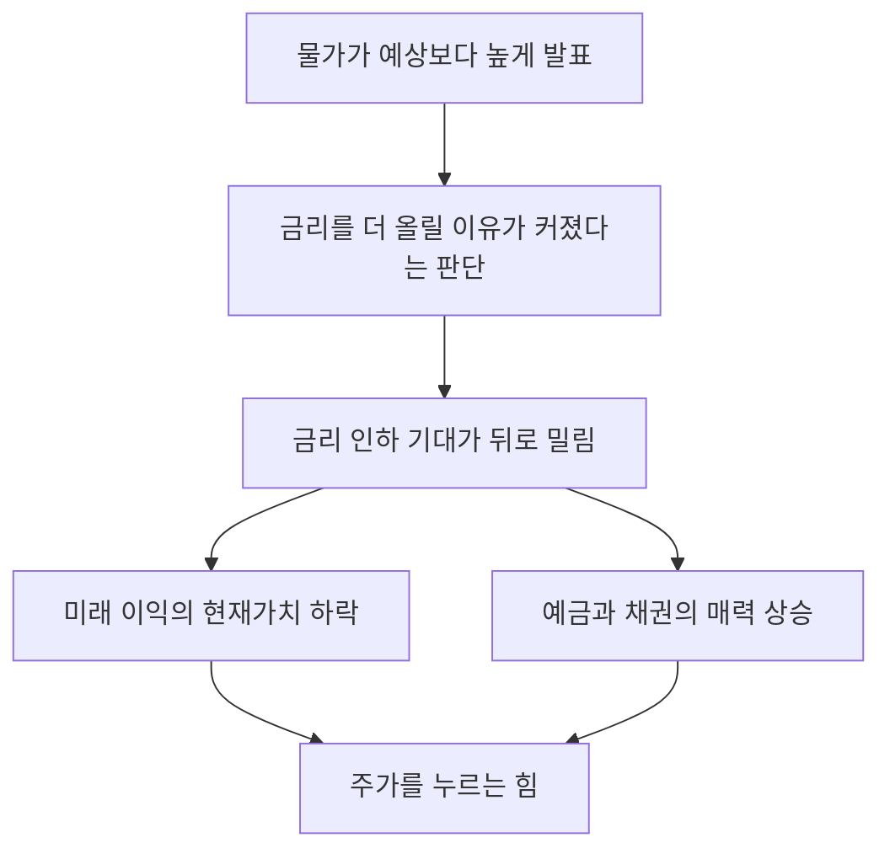

# 경제 뉴스 읽는 법 — FOMC, CPI, 고용지표가 뭐길래

경제 뉴스를 열면 영어 약자가 쏟아져요. **FOMC, CPI, PCE, PMI, ISM, NFP.** 하나하나 검색해봐도 뜻만 나오고 "그래서 그게 내 계좌랑 무슨 상관인데"는 안 나오죠.

**이 글은 약자 사전이 아니에요.** 그 지표들이 왜 시장을 움직이는지, 그 연결 고리를 다뤄요. 연결 고리를 알면 처음 보는 지표가 나와도 어디에 놓고 봐야 할지가 잡혀요.

## 핵심 답변

**뉴스에 나오는 경제지표는 많아 보이지만, 시장이 그걸 보는 이유는 대체로 하나로 모여요.**

> **"그래서 금리가 어디로 갈까"**

[6-1. 금리와 주가의 관계](6-1-interest-rate-and-stocks.md)에서 봤듯 금리가 오르면 주가를 누르는 힘이 세 갈래로 생기고, 내리면 반대로 작동해요. **금리는 시장 전체에 한꺼번에 작동하는 몇 안 되는 변수예요.**

그리고 금리를 정하는 곳은 지표를 보고 정해요. 그러니 **지표 발표는 곧 "다음 금리 결정이 어느 쪽으로 기울까"에 대한 새로운 정보**인 셈이에요. 시장이 물가 발표에 반응하는 건 물가 자체 때문이 아니라 그 뒤에 올 금리 때문이에요.

**그래서 초보가 외워야 할 지표는 셋이면 충분해요.** 물가, 고용, 그리고 금리 결정 그 자체예요.

## 셋만 알면 돼요

| 지표 | 무엇을 재나 | 왜 시장이 보나 |
|---|---|---|
| **물가** | 물건과 서비스 값이 얼마나 올랐나 | 물가가 높으면 금리를 올려 잡으려 해요 |
| **고용** | 일자리가 늘었나 줄었나, 임금은 올랐나 | 고용이 뜨거우면 물가를 밀어 올려요 |
| **금리 결정** | 중앙은행이 실제로 금리를 어떻게 했나 | 앞의 둘이 향하던 결론이 확정되는 자리예요 |

**하나씩 볼게요.**

### 물가 — 소비자물가지수(CPI)

[6-2. 인플레이션과 투자](6-2-inflation.md)에서 본 **소비자물가지수**예요. 가계가 많이 사는 상품과 서비스의 값을 조사해 하나의 숫자로 묶은 것이고, 줄여서 **물가지수**라고도 해요. 영어 약자 **CPI**는 Consumer Price Index의 앞 글자예요.

- **한국** — **국가데이터처**가 조사해 **매달 한 번, 다음 달 초**에 발표해요(2026년 8월 기준). 원래 통계청이 하던 일인데 2025년 10월 1일 개편되면서 이름이 바뀌었어요
- **미국** — **노동통계국**(BLS)이 **매달 한 번, 대체로 다음 달 중순**(10~15일 무렵)에 발표해요

### 고용 — 고용상황 보고서

**고용지표**는 일자리가 얼마나 늘거나 줄었는지를 보여주는 숫자예요. 미국에서 가장 크게 주목받는 건 노동통계국의 **고용상황 보고서**로, 여기에 **비농업부문 고용**(농업을 뺀 일자리 증감), **실업률**, **임금 상승률**이 함께 담겨요.

**발표는 대체로 매월 첫 금요일이에요.** 다만 **"대체로"**예요 — 휴일이 겹치거나 특별한 사정이 있으면 밀려요. 실제로 미국 연방정부 업무가 중단되면서 발표가 미뤄지거나 아예 건너뛴 적도 있어요. **그래서 날짜를 외우기보다 그달의 발표 일정을 확인하는 편이 나아요.**

### 금리 결정 — 금통위와 FOMC

[6-1](6-1-interest-rate-and-stocks.md)에서 봤듯 한국은 **한국은행 금융통화위원회**가 **통화정책방향 결정회의**에서, 미국은 **연방공개시장위원회**(FOMC)가 **정기 회의**에서 기준금리를 정해요. **두 회의 모두 1년에 여덟 번 열리고**(2026년 8월 기준) 날짜는 미리 공개돼 있어요. **다만 상황이 급하면 임시 회의가 열릴 수 있어요.**

### 미국 발표는 한국시간 몇 시인가

미국 지표는 발표 시각이 정해져 있어요. [3-2. 미국주식 거래 시간](../part3-us-overseas/3-2-us-trading-hours.md)의 규약대로 **한국시간을 먼저 쓰고 미국 동부시간을 병기**하고, **서머타임 적용기와 미적용기를 나눠서** 적을게요.

| 발표 | 한국시간 (서머타임 적용기) | 한국시간 (미적용기) | 미국 동부시간 |
|---|---|---|---|
| 소비자물가지수·고용상황 보고서 | **밤 9시 30분** | **밤 10시 30분** | 오전 8시 30분 |
| FOMC 결과 발표 | **다음 날 새벽 3시** | **다음 날 새벽 4시** | 오후 2시 |

**미국은 서머타임을 쓰고 한국은 안 쓰기 때문에 한국시간 기준으로 1년에 두 번 한 시간씩 밀려요.** 시차는 서머타임 적용기에 13시간, 미적용기에 14시간이에요([3-2](../part3-us-overseas/3-2-us-trading-hours.md)).

**여기서 하나 눈에 띄는 게 있어요. 지표 발표는 미국 정규장이 열리기 전이에요.** 미국 정규장은 동부시간 오전 9시 30분에 시작하니, 오전 8시 30분 발표는 개장 한 시간 전인 거예요. **그래서 그날 미국장은 이미 그 숫자를 보고 출발해요.** 반대로 FOMC 결과는 장 중에 나오고요.

## 물가와 고용이 왜 금리로 이어지나

**이 절이 지표를 하나로 꿰는 부분이에요.**

중앙은행이 금리를 올리는 건 대체로 **경제가 뜨거워서**예요. 사람들이 돈을 잘 쓰고, 일자리가 넘치고, 그래서 물가가 오를 때요. 금리를 올려 돈 빌리는 값을 비싸게 만들면 소비와 투자가 줄고 열기가 식어요.

그래서 이렇게 이어져요.

- **물가가 높게 나오면** → 금리를 올릴 이유가 커져요
- **고용이 아주 좋게 나오면** → 사람들이 돈을 더 쓰고 임금도 오르니 **물가를 밀어 올릴 이유**가 돼요 → 역시 금리를 올릴 쪽으로 기울어요
- **고용이 나쁘게 나오면** → 경기가 식고 있다는 신호이니 **금리를 내릴 여지**가 생겨요

**여기서 초보가 가장 많이 놀라는 지점이 나와요.**

> **경제에 좋은 뉴스가 주가에는 나쁘게 작동할 수 있어요.**

"일자리가 예상보다 훨씬 많이 늘었다"는 분명 좋은 소식인데, 시장은 그걸 **"금리가 더 오래 높게 유지되겠구나"**로 읽고 주가가 빠지기도 해요. **뉴스의 좋고 나쁨과 주가의 방향이 어긋나 보이는 날은 대개 이 구조 때문이에요.**

**반대도 마찬가지예요.** 고용이 나쁘게 나왔는데 주가가 오르는 날이 있어요. 금리 인하 기대가 커진 거죠. 다만 **이건 어느 정도까지만 통해요.** 고용이 너무 심하게 나빠지면 그때는 "금리를 내려도 경기가 무너진다"는 걱정이 이겨서 주가도 함께 빠져요. **같은 지표가 정도에 따라 정반대로 해석되는 거예요.**

## 숫자보다 중요한 건 예상 대비예요

**이 절이 이 챕터의 중심이고, [6-1](6-1-interest-rate-and-stocks.md)이 넘긴 숙제예요.**

경제 뉴스를 읽을 때 가장 흔한 오해가 이거예요. **"물가가 올랐다니까 주가가 빠지겠네."** 그런데 실제로는 물가가 올랐는데 주가가 오르는 날이 아주 흔해요.

**이유는 하나예요. 시장은 발표 전에 이미 예상하고 있었고, 그 예상이 지금 가격에 들어가 있어요.**

발표 일정은 미리 공개돼 있고, 여러 기관의 이코노미스트들이 각자 전망치를 내놔요. **그 전망치들을 모아 평균낸 값을 컨센서스, 우리말로는 시장 예상치라고 불러요.** 금융정보 제공업체나 언론사가 집계해 발표 전에 공개해요.

**그래서 시장을 움직이는 건 발표값 그 자체가 아니라 예상과의 차이예요.**

| 상황 | 시장 반응 |
|---|---|
| 물가가 올랐는데 **예상보다는 덜 올랐다** | 안도 — 주가가 오를 수 있어요 |
| 물가가 내렸는데 **예상만큼은 안 내렸다** | 실망 — 주가가 빠질 수 있어요 |
| 발표값이 **예상과 거의 같다** | 큰 움직임이 없는 경우가 많아요 |

**"물가가 내렸는데 주가가 빠졌다"는 헤드라인이 이해되기 시작하죠.** 내리긴 내렸는데 시장이 기대한 만큼은 아니었던 거예요.

**이건 [1-1. 주식이란 무엇인가](../part1-basics/1-1-what-is-stock.md)가 확정한 내용의 연장이에요.** 주가는 회사 가치를 주식 수로 나눈 값이 아니라 **앞으로에 대한 기대가 얹혀 정해지는 가격**이라고 했죠. **기대가 이미 가격에 들어가 있으니, 새 정보가 가격을 움직이려면 그 기대와 달라야 해요.**

**그래서 지표를 볼 때는 숫자 하나가 아니라 세 개를 같이 봐야 해요.** ① 이번 발표값 ② 시장 예상치 ③ 지난번 값이에요. 셋을 나란히 놓지 않으면 그 숫자가 좋은 건지 나쁜 건지 판단할 근거가 없어요.

## 뉴스를 읽을 때 조심할 것

**첫째, "~때문에 올랐다"는 대부분 사후 해석이에요.**

기사는 매일 그날의 등락에 이유를 붙여요. 그런데 하루의 주가 움직임에는 수많은 요인이 섞여 있고, **그중 하나를 원인으로 특정하는 건 사실상 불가능해요.** 같은 날 같은 사건을 두고 서로 다른 이유를 붙인 기사가 나란히 나오는 것도 그래서예요.

**"오늘 왜 올랐나"보다 "이 지표가 금리 방향에 어떤 정보를 줬나"를 묻는 쪽이 훨씬 쓸모 있어요.**

**둘째, 지표 하나로 매매하지 않아요.**

[5-6. 가치평가의 한계](../part5-analysis/5-6-limits-of-valuation.md)에서 기업 지표에 대해 한 얘기가 경제지표에도 그대로 적용돼요. **지표는 답을 주는 도구가 아니라 질문을 좁혀주는 도구예요.** 물가 발표 하나가 앞으로 몇 달의 시장을 결정하지 않고, 다음 달 발표가 방향을 뒤집는 일도 흔해요.

**셋째, 속보의 숫자는 나중에 수정되기도 해요.**

경제 통계는 처음 발표된 뒤 자료가 더 모이면 고쳐서 다시 발표되는 경우가 있어요. 특히 고용 관련 숫자가 그래요. **처음 나온 숫자에 크게 반응했는데 몇 달 뒤 그 숫자가 조용히 바뀌어 있는 일이 실제로 생겨요.**

**넷째, 이건 정보이지 신호가 아니에요.**

이 글에서 배운 것은 **뉴스를 이해하는 틀**이지 **언제 사고팔지에 대한 답**이 아니에요. 발표 직후의 가격은 이미 그 정보를 반영해 움직인 뒤예요. **개인이 발표를 보고 반응해서 앞서가기는 어렵다**는 점은 정직하게 알고 있는 게 좋아요.

## 예시로 이해하기 — 예상 3.0%, 실제 3.5%

**전부 가정한 상황이에요.** 실제 발표값이 아니고, 실제로 이런 일이 일어났다는 뜻도 아니에요.

**발표 전 상황**

| | 값 |
|---|---|
| 지난달 물가상승률 | 3.2% |
| 시장 예상치(컨센서스) | **3.0%** |

시장은 물가가 3.2%에서 3.0%로 **내려갈 것**이라고 보고 있었어요. 그러면 금리를 더 올릴 이유가 줄어드니, **그 기대가 이미 주가에 얹혀 있는 상태**예요.

**발표 결과**

| | 값 |
|---|---|
| 실제 발표값 | **3.5%** |

**여기서 세 숫자를 나란히 놓아볼게요.**

- 지난달 3.2% → 이번 3.5%이니 **물가가 오히려 올랐어요**
- 예상 3.0% → 실제 3.5%이니 **예상보다 0.5%포인트 높아요**

**시장이 놀라는 건 두 번째 줄 때문이에요.** 방향도 반대이고 폭도 컸으니까요.

**그다음 연쇄는 이렇게 이어져요.**

**즉 물가 발표가 주가로 이어지는 경로는 물가 자체가 아니라 금리 기대를 거쳐요.** 그리고 그 뒤는 [6-1](6-1-interest-rate-and-stocks.md)에서 본 세 경로와 같아요.

**여기서 세 가지를 짚을게요.**

**① 만약 실제 발표값이 3.0%였다면** 예상과 같으니 큰 움직임이 없었을 가능성이 커요. **같은 3.0%라는 숫자가 예상이 3.5%였을 때는 호재가 되고, 예상이 2.5%였을 때는 악재가 돼요.** 숫자 자체에는 좋고 나쁨이 없어요.

**② 3.5%라는 값이 나왔어도 주가가 오를 수 있어요.** 발표 내용을 뜯어보니 오른 이유가 일시적인 요인 하나 때문이라고 시장이 판단하면, 헤드라인 숫자와 반대로 움직여요. **시장은 헤드라인만 보는 게 아니에요.**

**③ 이 글은 이 상황에서 무엇을 하라고 말하지 않아요.** 위 그림은 **왜 그렇게 움직였는지를 이해하는 틀**이고, 앞에서 봤듯 이 정보는 발표 순간에 이미 가격에 반영돼요.

## 한 줄 정리

경제뉴스에 나오는 지표는 많아 보이지만 **물가·고용·금리 결정 셋이면 뼈대가 잡혀요.** 그리고 셋이 향하는 질문은 하나예요 — **"그래서 금리가 어디로 갈까"**([6-1](6-1-interest-rate-and-stocks.md)).

**가장 중요한 건 발표값 자체가 아니라 예상과의 차이예요.** 시장은 예상을 이미 가격에 넣어 두었기 때문에, 물가가 내렸는데도 주가가 빠지고 고용이 나쁜데도 주가가 오르는 일이 생겨요. **그래서 지표는 항상 이번 값·예상치·지난 값 셋을 나란히 놓고 봐야 해요.**

**그리고 뉴스가 붙이는 "~때문에"는 대부분 사후 해석이고, 지표 하나로 매매하지 않아요.** 기업 지표에 대해 [5-6](../part5-analysis/5-6-limits-of-valuation.md)이 한 말이 경제지표에도 그대로 적용돼요.

파트 6의 마지막은 조금 다른 이야기예요. 지금까지는 시장에서 돈을 어떻게 다룰지를 봤다면, 마지막 챕터는 **그 돈을 노리는 쪽**을 다뤄요. [6-7. 흔한 투자 사기 유형과 피하는 법](6-7-investment-scams.md)에서 이어서 볼게요.

---

> 이 글은 투자 판단에 도움이 되는 일반적인 정보를 제공할 뿐, 특정 종목이나 상품의 매매를 권유하지 않아요. 제도와 세금은 바뀔 수 있으니 실제 투자 전에는 최신 내용을 다시 확인하세요.

> 함께 보면 좋은 글
> - [1-1. 주식이란 무엇인가 — 회사 지분을 산다는 것의 의미](../part1-basics/1-1-what-is-stock.md)
> - [3-2. 미국주식 거래 시간과 프리마켓·애프터마켓](../part3-us-overseas/3-2-us-trading-hours.md)
> - [5-6. 가치평가의 한계 — 지표만 보면 안 되는 이유](../part5-analysis/5-6-limits-of-valuation.md)
> - [6-1. 금리와 주가의 관계 — 왜 금리가 오르면 주가가 떨어지나](6-1-interest-rate-and-stocks.md)
> - [6-2. 인플레이션과 투자 — 현금은 왜 녹는가](6-2-inflation.md)
> - [6-7. 흔한 투자 사기 유형과 피하는 법](6-7-investment-scams.md)
